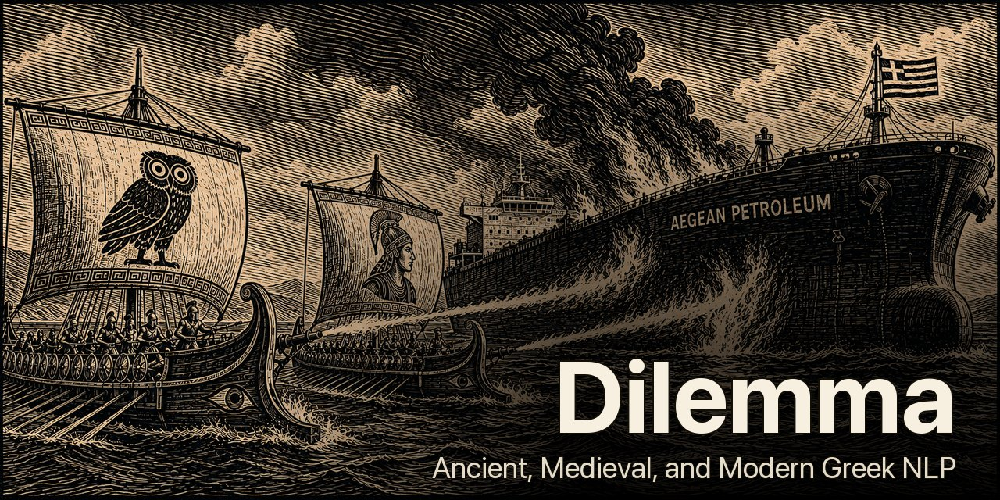

# Dilemma     [](https://github.com/open-greek/dilemma/actions/workflows/test.yml)

<p align="center">
  
</p>

Dilemma is a diachronic Greek lemmatizer spanning Ancient Greek (Classical,
Homeric, Hellenistic), Medieval/Byzantine Greek (both vernacular and
literary), and Modern Greek (Demotic and Katharevousa).

It is part of the [Open Greek](https://github.com/open-greek) project and the
NLP companion to the [Open Greek Corpus](https://github.com/open-greek/open-greek-corpus),
whose corrected open-licensed texts feed its corpus frequencies and
form-attestation data.

### A four-layer pipeline, not a single model

Dilemma stacks complementary techniques and falls back through them in
priority order, so the expensive layer only runs on the words the cheap
layers can't reach. This is the single most important thing to know
about the design.

| # | Layer | Resolves | Speed |
|---|-------|----------|-------|
| 1 | **8.6M-form SQLite lookup** | known forms (Wiktionary + LSJ + Sophocles + GLAUx + treebanks) | `O(1)` hash, microseconds |
| 2 | **Rule-based fallback** | augment / reduplication stripping, elision, crasis, enclitic particles, compound decomposition | `O(1)` per rule |
| 3 | **Dialect normalization** | Ionic, Doric, Aeolic, Koine -> Attic, so the (Attic-heavy) lookup can match | `O(k)` candidates |
| 4 | **Character-level transformer** | unseen forms the other three layers miss | beam search, `O(b·n²)` |

The lookup carries the bulk; layers 2-3 catch systematic things a lookup
table can't enumerate exhaustively; layer 4 (a 4M-parameter
encoder-decoder trained from scratch on 3.5M supervised pairs) only sees
the ~5% the cheap layers can't resolve. That is why Dilemma is both
faster than pipelines that route every word through a model and more
accurate than ones that lean only on a lookup table.

See [Pipeline overview](#pipeline-overview) for the full layer list with
every sub-rule (particle stripping, BK-tree spell correction, etc.).

### Three distinctive choices within the pipeline

**An 8.6M-form lookup driven by Wiktionary's own Lua modules.** The
biggest contributor to layer 1's coverage is running
[`Module:grc-decl`](https://en.wiktionary.org/wiki/Module:grc-decl) and
[`Module:grc-conj`](https://en.wiktionary.org/wiki/Module:grc-conj)
-- the modules Wiktionary editors invoke via templates when writing
inflection tables -- via
[wikitextprocessor](https://github.com/tatuylonen/wikitextprocessor)
over the LSJ headword set (32K nouns + 22K verbs + 14K adjectives) and
the Sophocles Byzantine/Patristic lexicon (13.5K nouns + 4.6K verbs).
That generates ~2.9M extra inflected AG forms no editor has touched,
lifting the AG lookup from 2.4M Wiktionary-only entries to 5.3M, and the
full lookup to 8.6M forms across all languages -- the largest compiled
for Greek. This single mechanism closes the
classical and Byzantine vocabulary gap that every other tool has. See
[LSJ/Sophocles expansion](#lsjsophocles-expansion).

**A character-level encoder-decoder for layer 4, not a fine-tuned
subword LM.** The [SIGMORPHON](https://sigmorphon.github.io/)
architecture (4M params, ~50 MB ONNX) trained from scratch on 3.5M
`(form, lemma)` pairs from Wiktionary inflection tables (including the
LSJ verb-paradigm Lua expansion) plus the GLAUx morphologically-tagged
corpus. (The other treebanks and the LSJ/Sophocles noun expansion feed
the lookup table, not the model.) Existing Greek
tools either fine-tune giant subword models (stanza, spaCy, ~300M+
params) or use hand-coded rule engines (Morpheus, CLTK) that don't
generalize. Training from scratch takes ~35 min on a 4090; the small
specialized model matches *ByT5-small* (300M params, 20-hour fine-tune)
because Greek lemmatization is pattern-rich enough that 4M parameters
of Greek-specific capacity beat 300M of general capacity. See
[Transformer model](#transformer-model).

**Convention remapping baked into the API.** The same word has
different citation forms in different dictionaries -- LSJ writes εἶπον
as `λέγω`, Cunliffe writes γίνεται as `γίγνομαι`, Triantafyllidis
writes σπήλαια as `σπήλαιο`. Other tools lock you into whatever
convention their training treebank used. `Dilemma(convention=...)`
remaps the output to LSJ, Cunliffe, Triantafyllidis, or Wiktionary at
runtime from the same model weights:

```python
Dilemma(convention="lsj")               # LSJ headwords
Dilemma(convention="cunliffe")          # Cunliffe Homeric Lexicon
Dilemma(convention="triantafyllidis")   # Triantafyllidis MG dictionary
Dilemma()                               # default: Wiktionary headwords
```

This is the difference between scoring 65% on a benchmark because of
citation mismatch and 95% on the underlying linguistic task. See
[Conventions](#conventions).

### Worth flagging

- **No other lemmatizer covers Ancient, Byzantine, and Modern Greek
  in one system.** Morpheus is classical AG only; stanza is AG or MG
  but not both. Dilemma resolves Katharevousa, vernacular medieval, and
  regional MG varieties (Cypriot, Cretan) alongside Homer and Herodotus.
- **Dialect normalization is systematic, not a wordlist.** No other
  Greek lemmatizer handles Ionic/Doric/Aeolic/Koine variation this way.
- **Elision recovery does consonant de-assimilation.** `καθ’` becomes
  `κατά` by reversing the aspiration rule, with corpus frequency as the
  tiebreaker between candidates.
- **Fully supervised, end to end.** Every training pair is labelled
  (Wiktionary tables, Lua expansions, gold treebanks) and the lookup is
  a dictionary of correct answers -- nothing relies on unsupervised
  pattern discovery from raw text. Failure modes are predictable and
  fixes reproducible: edit the Wiktionary entry, rerun the pipeline,
  the fix flows through.

**SQLite + ONNX backends:** The lookup loads from a pre-built SQLite
database (~0.3s startup) instead of parsing 600 MB of JSON (~11s),
falling back to JSON if the DB isn't present. ONNX Runtime (~50 MB) and
PyTorch (~2 GB) produce identical inference results -- use whichever
you already have. The lookup handles 95%+ of words and needs neither.

## Table of Contents

- [Quick Start](#quick-start)
  - [Installation](#installation)
  - [Basic Usage](#basic-usage)
  - [Conventions](#conventions)
- [Evaluation](#evaluation)
  - [Multi-period benchmarks](#multi-period-benchmarks)
  - [Rare vocabulary coverage](#rare-vocabulary-coverage)
  - [DiGreC treebank](#digrec-treebank)
  - [HNC Modern Greek](#hnc-modern-greek)
- [How It Works](#how-it-works)
  - [Pipeline overview](#pipeline-overview)
  - [Lookup table](#lookup-table)
  - [Rule-based fallback layer](#rule-based-fallback-layer)
  - [Dialect normalization](#dialect-normalization)
  - [Orthographic normalizer](#orthographic-normalizer)
  - [Transformer model](#transformer-model)
- [API Reference](#api-reference)
  - [Language and convention options](#language-and-convention-options)
  - [Verbose mode](#verbose-mode)
  - [Batch processing](#batch-processing)
  - [POS-aware disambiguation](#pos-aware-disambiguation)
  - [Spelling correction](#spelling-correction)
  - [Paradigm generation](#paradigm-generation)
  - [Elision expansion](#elision-expansion)
- [POS tagger and dependency parser](#pos-tagger-and-dependency-parser)
- [Greek Coverage](#greek-coverage)
  - [Language codes](#language-codes)
  - [Modern Greek varieties](#modern-greek-varieties)
  - [Ancient Greek varieties](#ancient-greek-varieties)
  - [Medieval/Byzantine Greek](#medievalbyzantine-greek)
- [Development](#development)
  - [Full installation](#full-installation)
  - [Training](#training)
  - [LSJ/Sophocles expansion](#lsjsophocles-expansion)
  - [Export to ONNX](#export-to-onnx)
  - [Testing](#testing)
  - [Frequency-ranked inflection lists](#frequency-ranked-inflection-lists)
  - [Hunspell spell-check export](#hunspell-spell-check-export)
  - [Polytonic next-word prediction LM](#polytonic-next-word-prediction-lm)
- [Data](#data)
  - [Sources and scale](#sources-and-scale)
  - [HuggingFace Hub dataset](#huggingface-hub-dataset)
  - [Confidence tiers](#confidence-tiers)
  - [Quality controls](#quality-controls)
  - [Related work](#related-work)
  - [Known issues](#known-issues)
- [Architecture](#architecture)
- [Projects using Dilemma](#projects-using-dilemma)
- [Credits](#credits)
- [License](#license)

<p align="center">
  
</p>

<p align="center">
  
</p>

---

## Quick Start

### Installation

```bash
pip install "dilemma-nlp[onnx] @ git+https://github.com/open-greek/dilemma.git"
python -m dilemma download
```

The first line installs the package plus ONNX Runtime (~50 MB, for unseen-form
inference). If you already have PyTorch installed, use `dilemma-nlp[torch]`
instead, or just plain `dilemma-nlp` to skip the model backend and rely on the
lookup table alone. The second line downloads the lookup tables, ONNX
model files, and tagger weights from HuggingFace into `~/.cache/dilemma/`
(~5.5 GB: lemma data ~4.5 GB + model ~0.07 GB + tagger weights ~1.0 GB; add
`--no-tagger` for the ~4.5 GB lemma-only download). The two opt-in
form-attestation DBs add ~1.2 GB more.

Dilemma uses `$DILEMMA_DATA_DIR` if set; otherwise it picks whichever of
`~/.cache/dilemma/data/` (the download), `<repo-root>/data/` (a clone), or a
bundled copy holds the most recently built or downloaded `lookup.db`, so a
fresh local rebuild is never shadowed by a stale download cache. Set
`DILEMMA_DATA_DIR` to force a specific copy.

To work from a git checkout (for development or to rebuild the data):

```bash
git clone https://github.com/open-greek/dilemma.git && cd dilemma
pip install -e ".[onnx]"
python -m dilemma download          # or use the build pipeline below
```

To build the data from scratch instead of downloading:

```bash
python build_data.py --download        # downloads Wiktionary dumps, builds lookup tables
python build_lookup_db.py              # builds SQLite DB for instant startup (optional)
python fix_selfmaps.py                 # fixes inflected forms that self-map (optional)
```

### Basic Usage

```python
from dilemma import Dilemma

d = Dilemma()                                  # all periods (default, AG-priority)
d.lemmatize("ἀνθρώπους")                      # "ἄνθρωπος"
d.lemmatize("ἔγραψα")                         # "γράφω"
d.lemmatize_batch(["λέγουσι", "θεούς"])       # ["λέγω", "θεός"]

# Elision expansion (AG elided forms resolved via Wiktionary lookup)
d.lemmatize("ἀλλ̓")                            # "ἀλλά"
d.lemmatize("ἔφατ̓")                           # "φημί"
d.lemmatize("δ̓")                              # "δέ"
d.lemmatize("κατ̓")                            # "κατά"

# Single period
d_mg = Dilemma(lang="el")                     # MG only
d_mg.lemmatize("τραγουδάει")                  # "τραγουδάω"
d_mg.lemmatize("έγραψε")                      # "γράφω"
d_grc = Dilemma(lang="grc")                   # AG only

# Specific model scale
d = Dilemma(scale="test")                     # use test-scale model

# Treebank evaluation mode: resolve articles to ὁ, pronouns to ἐγώ/σύ
d_eval = Dilemma(resolve_articles=True)
d_eval.lemmatize("τῆς")                       # "ὁ" (not "τῆς")
d_eval.lemmatize("μοι")                       # "ἐγώ" (not "μοι")

# Byzantine text with orthographic normalization
d_byz = Dilemma(normalize=True, period="byzantine")
d_byz.lemmatize("εκκλησια")                   # "ἐκκλησία" (restores accents and breathing)
```

By default, articles and pronoun clitics self-map (e.g. `τῆς` returns
`τῆς`). This is better for alignment pipelines where you want
surface-form matching. Set `resolve_articles=True` to resolve them
to canonical lemmas (`ὁ`, `ἐγώ`, `σύ`), matching treebank conventions
(AGDT, DiGreC, PROIEL). The `triantafyllidis` convention auto-enables
article resolution (articles to `ο`, skipping AG pronoun resolution
for forms like `σε`/`με` that are MG prepositions).

### Conventions

Different dictionaries cite the same Greek word differently. LSJ uses
`λέγω` for the εἶπον family; Cunliffe uses `γίγνομαι` rather than
`γίνομαι`; Triantafyllidis uses `είμαι` rather than `εἰμί`. A tool
that outputs `εἰμί` against a gold standard expecting `είμαι` looks
wrong, even though both answers are correct for their respective
conventions.

The `convention` parameter remaps Dilemma's output to whichever
standard you're targeting. The same model can serve an LSJ workflow, a
Cunliffe workflow, and a Triantafyllidis workflow without retraining.

| Convention | Target | Example mappings |
|------------|--------|-----------------|
| `None` (default) | Wiktionary headwords | `εἶπον`→`εἶπον`, `θεούς`→`θεός`, `σπήλαια`→`σπήλαιον` |
| `lsj` | [LSJ](https://github.com/ciscoriordan/lsj9) dictionary | `εἶπον`→`λέγω`, `αἰνῶς`→`αἰνός`, `σπηλαίου`→`σπήλαιον` |
| `cunliffe` | [Cunliffe](https://archive.org/details/lexiconofhomeric0000cunn) Homeric Lexicon | `γίνεται`→`γίγνομαι`, `θέλει`→`ἐθέλω`, `νοῦν`→`νόος` |
| `triantafyllidis` | [Triantafyllidis](http://www.greek-language.gr/greekLang/modern_greek/tools/lexica/triantafyllides/) MG dictionary | `ὁ`→`ο`, `εἰμί`→`είμαι`, `σπήλαιον`→`σπήλαιο`, `εἷς`→`ένας` |

The mapping is built automatically from `data/lemma_equivalences.json`
cross-referenced against the convention's headword list, with explicit
overrides in `data/convention_{name}.json`. Lemma equivalences also
group valid alternative lemmatizations (comparative/positive adjective
forms, active/deponent pairs, spelling variants) so that benchmarks
score them as correct rather than penalizing convention disagreements.

Note: `data/lemma_equivalences.json` covers Ancient Greek equivalences.
For Modern Greek, the lookup merge in `build_data.py` prefers EL
(Greek) Wiktionary lemma forms over EN (English) Wiktionary, since
EL uses the modern contracted forms that reflect actual usage
(`τρώω`, `λέω`) while EN tends toward fuller morphological stems
(`τρώγω`, `λέγω`). For the remaining cases where the two sources
use genuinely different lemmas, downstream consumers like
[Lemma](https://github.com/ciscoriordan/lemma) use a separate MG
equivalences file generated by cross-referencing
`mg_lookup_scored.json` against Wiktionary headwords, with corpus
frequency as a tiebreaker for the canonical form.

For individual form-to-lemma corrections where the lookup table returns
the wrong lemma due to ambiguity (e.g., proper nouns beating common
verbs), `build_lookup_db.py` has a `_LOOKUP_OVERRIDES` dict that
hard-corrects specific entries in the database.

Other tools (stanza, spaCy, CLTK) have fixed output conventions
matching their training treebanks and cannot be remapped.

```python
# LSJ lemma convention: remap output to LSJ dictionary headwords
d_lsj = Dilemma(convention="lsj")
d_lsj.lemmatize("αἰνῶς")                     # "αἰνός" (adverb -> adjective)
d_lsj.lemmatize("εἶπον")                      # "λέγω" (aorist -> present stem)

# Cunliffe convention: remap to Cunliffe Homeric Lexicon headwords
d_cun = Dilemma(convention="cunliffe")
d_cun.lemmatize("γίνεται")                    # "γίγνομαι" (Homeric form)
d_cun.lemmatize("θέλει")                      # "ἐθέλω" (Homeric form)
d_cun.lemmatize("νοῦν")                       # "νόος" (uncontracted Homeric form)

# Triantafyllidis convention: remap to Modern Greek monotonic forms
d_mg = Dilemma(convention="triantafyllidis")
d_mg.lemmatize("σπήλαια")                     # "σπήλαιο" (not σπήλαιον)
d_mg.lemmatize("Είναι")                       # "είμαι" (not εἰμί)
d_mg.lemmatize("εργαλεία")                    # "εργαλείο" (not ἐργαλεῖον)
d_mg.lemmatize("τα")                          # "ο" (not ὁ)
```

In the benchmark table, the first two Dilemma rows use the Wiktionary
convention. The `convention="triantafyllidis"` row auto-enables article
resolution (articles to `ο`, the `αυτός` demonstrative to `αυτός`) and outputs
monotonic MG lemma forms. This is the recommended setting for Modern
Greek text.

## Evaluation

### Multi-period benchmarks

Equiv-adjusted accuracy across four periods of Greek. All tools
evaluated with the same normalization (case-folded, accent-stripped)
and lemma equivalence groups (see `data/benchmarks/bench_all.py`).

**Test sets:**
- **AG Classical**: Sextus Empiricus, *Pyrrhoniae Hypotyposes* 1.1-1.8 (357 tokens, [First1KGreek](https://opengreekandlatin.github.io/First1KGreek/), [CC BY-SA 4.0](https://creativecommons.org/licenses/by-sa/4.0/)). Not in any UD treebank or Gorman.
- **Byzantine**: [Swaelens et al. (2024)](https://aclanthology.org/2024.lrec-main.899/) DBBE gold standard (8,342 tokens of unedited Byzantine epigrams, [CC BY 4.0](https://creativecommons.org/licenses/by/4.0/)). Not in the training data of any tool in the table below.
- **Katharevousa**: Konstantinos Sathas, *Neoelliniki Filologia* (1868), biography of Bessarion (318 tokens, [el.wikisource.org](https://el.wikisource.org/), [public domain](https://en.wikipedia.org/wiki/Public_domain)). No Katharevousa treebank exists.
- **Demotic MG**: Greek Wikipedia articles "[Σπήλαιο Πετραλώνων](https://el.wikipedia.org/wiki/Σπήλαιο_Πετραλώνων)" and "[Ελαιόλαδο](https://el.wikipedia.org/wiki/Ελαιόλαδο)" (400 tokens, [CC BY-SA 4.0](https://creativecommons.org/licenses/by-sa/4.0/)). Not in any MG treebank. A separate dev set (251 tokens from "[Μέλισσα](https://el.wikipedia.org/wiki/Μέλισσα)" and "[Σαμοθράκη](https://el.wikipedia.org/wiki/Σαμοθράκη)") is also included at `data/benchmarks/demotic_dev.txt`.

| Tool | AG Classical | Byzantine (literary) | Katharevousa | Demotic MG |
|------|:--------:|:--------:|:--------:|:--------:|
| [spaCy](https://spacy.io/) `el` | -- | 31.7% | 44.6% | 79.9% |
| [stanza](https://stanfordnlp.github.io/stanza/) `el` | -- | 37.4% | 48.4% | 87.0% |
| [Swaelens et al. (2024)](https://aclanthology.org/2024.lrec-main.899/) | -- | 65.8% | -- | -- |
| [CLTK](https://github.com/cltk/cltk) | 81.2% | 66.6% | 74.8% | -- |
| [Morpheus](https://github.com/perseids-tools/morpheus-perseids-api) (oracle) | -- | 71.1% | -- | -- |
| [stanza](https://stanfordnlp.github.io/stanza/) `grc` | 92.2% | 71.3% | 85.2% | -- |
| [Swaelens et al. (2025)](https://aclanthology.org/2025.acl-long.430/) | -- | ~74-75% | -- | -- |
| **Dilemma** (best convention per period) | **99.7%** | **88.4%**‡ | **94.3%** | **94.8%**† |

<sub>†For Demotic MG, `lang="el"` with `triantafyllidis` (94.8%) matches `lang="all"` with `triantafyllidis`. For MG-only workloads, `lang="el"` with `triantafyllidis` is recommended since it avoids AG lemmas (e.g. σπήλαιον) being returned for MG words that have an AG lookalike. ‡Byzantine is 88.4% from the static lookup alone (no POS); with per-token POS (the shipped grc tagger, or gold POS) it reaches 91.6%, since much of the residual is genuine syncretism (θεῶ = dat. θεός vs θεάομαι) that only context resolves.</sub>

Cells marked `--` indicate the tool doesn't support that period or
wasn't tested. Morpheus "oracle" picks the best candidate from all its
analyses, representing the ceiling for rule-based morphology. (The TLG
lemmatizer is compared separately [below](#dilemma-vs-the-tlg-lemmatizer),
since it reports a different metric and no per-era breakdown.)

**Dilemma detail by convention:**

| Lang | Convention | POS | AG Classical | Byzantine (literary) | Katharevousa | Demotic MG |
|------|------------|-----|:--------:|:--------:|:--------:|:--------:|
| `all` | `wiktionary` (default) | -- | 99.7% | 88.4% | 94.3% | 79.5%* |
| `all` | `wiktionary` (default) | gold | -- | 91.6% | -- | -- |
| `all` | `triantafyllidis` | -- | 87.7% | 78.4% | 89.3% | 94.8%† |
| `grc` | `wiktionary` (default) | -- | 99.7% | 87.4% | 94.0% | 79.5%* |
| `grc` | `triantafyllidis` | -- | 91.0% | 82.1% | 91.2% | 89.2% |
| `el` | `wiktionary` (default) | -- | 95.2% | 83.7% | 91.2% | 90.0% |
| `el` | `triantafyllidis` | -- | 87.7% | 78.4% | 89.3% | 94.8% |

<sub>\*Demotic MG scores with `wiktionary` convention are convention mismatches, not real accuracy gaps: AG citation forms like `σπήλαιον` don't match the MG gold standard `σπήλαιο`. Using `convention="triantafyllidis"` fixes this. The AG and Byzantine benchmarks run with `resolve_articles=True` (the correct setting for gold that lemmatizes articles, e.g. τὸν -> ὁ); the article paradigm is otherwise excluded from the lookup so MG function words don't leak to AG forms.</sub>

`lang="all"` searches both AG and MG lookup tables for every token.
Other tools in the comparison table are locked to a single language.
The `wiktionary` convention outputs polytonic AG citation forms. The
`triantafyllidis` convention outputs monotonic MG lemma forms and is
the recommended setting for Modern Greek text (see
[Conventions](#conventions)).

POS column: `--` means Dilemma disambiguates on its own (default).
`gold` means gold-standard POS tags from the dataset are fed in. Only
DBBE provides gold POS; the negligible difference (92.7% vs 92.6%)
confirms POS ambiguity is not a significant error source.

The eval scripts (`eval/eval_dbbe.py`, `eval/eval_digrec.py`,
`eval/eval_hnc.py`, `eval/bench_dbbe.py`) provide per-POS breakdowns
and error categorization.

### Dilemma vs the TLG lemmatizer

The [Thesaurus Linguae Graecae](https://stephanus.tlg.uci.edu/history.php)
(TLG) runs the only other diachronic Greek lemmatizer of comparable scope.
It is proprietary, bound to the subscription TLG corpus and search engine,
and cannot be run on external text. The only figure it publishes is a
*recognition* rate (the share of wordforms its lexicon + paradigm analyzer
can identify): 98.4%, including Byzantine and early-modern forms (Pantelia
2022). It does not report lemma-disambiguation accuracy.

To compare on equal footing, Dilemma's recognition rate is measured the same
way: the share of wordforms it resolves via lookup + deterministic rules,
with the neural model excluded (TLG has none, and the model maps almost any
string to a nearest headword). Measured over the full held-out First1KGreek
corpus (24.4M word tokens, ancient + patristic, not a Dilemma lookup source):

| | TLG lemmatizer | Dilemma |
|---|:--:|:--:|
| Recognition rate (wordforms analyzed) | 98.4%¹ | 98.8%² |
| Lemma accuracy (correct lemma chosen) | not published | 96.0%³ |
| Era coverage | ancient → Byzantine (to ~1669) | ancient → Byzantine → Modern (incl. Demotic) |
| Open source | No | Yes |
| Runs on arbitrary text | No (TLG corpus only) | Yes |

<sub>¹ Recognition over the TLG's own subscription corpus (Pantelia,
*Thesaurus Linguae Graecae: A Bibliographic Guide to the Canon of Greek
Authors and Works*, UC Press, 2022). ² Dilemma lexicon + rules only (no
neural model, to match TLG), token-level over 24.4M held-out First1KGreek
tokens (Dilemma normalizes lunate sigma ϲ→σ/ς internally, since these
editions use it throughout). The remaining 1.2% unrecognized is almost
entirely editorial sigla, Greek numerals, and abbreviations (γρ, ΙΙ, κζ),
not vocabulary gaps. Enabling the neural model lifts the full pipeline to
~99.7%. ³ Unweighted mean of the four per-period accuracy
scores above (token-weighted, 93.2%) - a metric TLG does not publish.</sub>

The two systems are on par on recognition. Beyond that, Dilemma additionally
reports lemma accuracy, extends into Standard Modern Greek (Demotic), is open
source, and runs as a library on arbitrary text rather than only inside a
subscription corpus.

### Rare vocabulary coverage

Following [SIGMORPHON](https://sigmorphon.github.io/) shared task
methodology for out-of-vocabulary evaluation, we exclude the 3,000 most
frequent Greek forms and capitalized words, then check whether the output
lemma is a valid LSJ/Wiktionary headword. This tests the hard tail that
matters for real texts.

| Text | Period | Morpheus | Stanza | Dilemma |
|------|--------|:--------:|:------:|:-------:|
| Xenophon, *Cyropaedia* | Attic | 99.5% | 84% | **99.6%** |
| Kresadlo, *Astronautilia* 13 | Epic | 74% | 74% | **84%** |
| Herodotus, *Histories* | Ionic | 99.5% | 88% | **99.9%** |

<sub>On Cyropaedia, gold accuracy vs Gorman treebank annotations is
93.2%. The remaining gap is convention differences (e.g. κτάομαι vs
κτέομαι, ᾄδω vs ἀείδω), not missing forms. Herodotus gold-match
accuracy (vs PROIEL annotations) is 95.3%, where the gap is almost
entirely convention differences (Ionic vs Attic spelling, plural
ethnonym lemmas, voice conventions), not missing forms or
disambiguation failures.</sub>

### DiGreC treebank

On the [DiGreC treebank](https://github.com/mdm33/digrec) (~56K tokens,
Homer through 15th century Byzantine Greek), Dilemma reaches 93.7%
equiv-adjusted (90.3% strict). The gap accounts for convention
differences between annotation schemes (e.g. `εἶπον`/`λέγω`,
`ἐγώ`/`ἡμεῖς`).

### HNC Modern Greek

`eval_hnc.py` evaluates against the
[HNC Golden Corpus](https://inventory.clarin.gr/corpus/870) (88K tokens
of gold-standard Modern Greek from CLARIN:EL).

## How It Works

### Pipeline overview

| Layer | Speed | Coverage | Source |
|-------|-------|----------|--------|
| **Lookup table** | hash lookup `O(1)` | 8.6M known forms | Wiktionary + LSJ + Sophocles + GLAUx + treebanks |
| **Normalizer** | k candidates `O(k)` | Byzantine orthographic variants | Rule-based candidate generation |
| **Elision expansion** | v=7 vowels `O(v)` | AG elided forms | Vowel expansion against lookup |
| **Crasis table** | hash lookup `O(1)` | ~40 common crasis forms | Hand-curated |
| **Particle suffix stripping** | suffix check `O(1)` | AG enclitic forms (-per, -ge, -de, deictic -i) | Strip suffix, re-lookup base form |
| **Verb morphology stripping** | prefix check `O(1)` | Unseen augmented/reduplicated verb forms | Strip augment/reduplication, re-lookup |
| **Dialect normalization** | k candidates `O(k)` | Ionic, Doric, Aeolic, Koine dialect forms | Map dialect forms to Attic equivalents |
| **Compound decomposition** | n=word length `O(n)` | Byzantine compound words | Split at linking vowel, look up base |
| **Spelling correction** | BK-tree `O(d·m)` | ED0-2 suggestions for unknown words | Accent-stripped edit distance |
| **Transformer** | beam search `O(b·n²)` | generalizes to unseen forms | Trained on Wiktionary pairs |

### Lookup table

The lookup table combines forms from multiple sources:

| Source | Forms | Notes |
|--------|------:|-------|
| **Wiktionary** (EN + EL, all periods) | 5.2M | Baseline from kaikki.org dumps |
| **LSJ** (Liddell-Scott-Jones) | 4.2M | 32K nouns, 22K verbs (incl. 700+ with principal parts parsed from the entry head and ~800 athematic / irregular μι-verbs), 14K adjectives, all expanded via Wiktionary Lua modules |
| **Sophocles Lexicon** (Byzantine/Patristic) | 1.0M | 13.5K nouns, 4.6K verbs, 1.5K adverbs from OCR'd TEI data |
| **[GLAUx](https://github.com/alekkeersmaekers/glaux)** (Keersmaekers, 2021) | 557K | 17M-token corpus, 8th c. BC - 4th c. AD, 98.8% lemma accuracy |
| **[Diorisis](https://figshare.com/articles/dataset/The_Diorisis_Ancient_Greek_Corpus/6187256)** (Vatri & McGillivray, 2018) | 76K new | 10M-token corpus, Homer - 5th c. AD, 91.4% lemma accuracy. Low-priority pairs (only added when no conflict with existing sources). Contributes to the merged 68.6M-token `corpus_freq.json` alongside GLAUx, PTA, and the [Open Greek Corpus](https://github.com/open-greek/open-greek-corpus) open-text rollup. |
| **[HNC Golden Corpus](https://inventory.clarin.gr/corpus/870)** (CLARIN:EL) | 1K new | 88K-token gold-standard MG corpus, 11K unique form-lemma pairs. Low priority (only added when not in Wiktionary). Also used for MG evaluation. |
| **[Perseus / AGDT](https://github.com/PerseusDL/treebank_data)** (CC BY-SA 3.0 US) | 81K | The 33 Greek AGDT works: Sophocles, Aeschylus, Homer, Hesiod, Herodotus, Thucydides, Plutarch, Polybius, Athenaeus. Sourced from the original, not the NonCommercial UD release. |
| **[Gorman Treebanks](https://github.com/perseids-publications/gorman-trees)** (CC BY-SA 4.0) | 79K | 687K-token corpus across Herodotus, Thucydides, Xenophon, Demosthenes, Lysias, Polybius, etc. Gold-standard single annotator. |
| **DGE** (Diccionario Griego-Espanol) | 52K | Headword filter coverage for spell-check |
| **LGPN** (Lexicon of Greek Personal Names) | 44K | Proper noun headword coverage |
| **Perseus Digital Library** (L&S, Pape, Bailly, etc.) | 176K | Headword filter from multiple classical lexica |
| **VLG** (Vocabolario della Lingua Greca, Montanari) | 133K | Headword filter coverage; 12K new beyond LSJ/DGE/Perseus |
| **Words in Progress** (Aristarchus supplementary lexicon, Montanari & Perrone) | 4K | Curated new/rare AG headwords with morphology; ~1,135 new |
| Closed-class fixes | ~500 | Articles, pronouns, prepositions mapped to canonical lemmas |

**Wiktionary Lua expansion.** Most of the non-Wiktionary forms above
come from running Wiktionary's own
[`grc-decl`](https://en.wiktionary.org/wiki/Module:grc-decl) and
[`grc-conj`](https://en.wiktionary.org/wiki/Module:grc-conj) Lua modules
over LSJ and Sophocles headwords, via
[wikitextprocessor](https://github.com/tatuylonen/wikitextprocessor).
These are the same modules Wiktionary editors invoke through
`{{grc-decl}}` / `{{grc-conj}}` templates when they paste in a headword
plus its grammatical metadata; the modules emit the full noun, verb, or
adjective paradigm. Wiktionary itself only renders those paradigms for
headwords an editor has manually written up. Running the modules over
the 32K nouns + 22K verbs + 14K adjectives in LSJ and the 13.5K nouns +
4.6K verbs in Sophocles produces millions of inflected forms for
classical and Byzantine vocabulary that no editor has touched, which
is what lifts the lookup table from 5.2M Wiktionary-only forms to 8.6M
total and is why rare-vocabulary coverage on classical and Patristic
texts is competitive with rule-based morphological analyzers. Cunliffe's
Homeric Lexicon (~12K headwords) isn't expanded this way because its
headwords are a subset of LSJ and already covered by the LSJ expansion
plus the GLAUx Homeric corpus (557K pairs). See
[LSJ/Sophocles expansion](#lsjsophocles-expansion) for the build step.

The verb expansion is more than just the present system. For each
verb headword, an LSJ-entry parser (`build/lsj_principal_parts.py`)
walks the head paragraph and pulls out whatever principal parts LSJ
has labelled (`fut.`, `aor.` 1 / 2, `pf.`, `pf. m./p.`, `aor. p.`,
`impf.`, `plpf.`), feeding each into `Module:grc-conj` as a
positional argument. About 712 LSJ-only verbs receive at least one
parsed principal part this way, lifting them from present-tense-only
expansion to full paradigm coverage and adding ~+55 unique forms per
eligible verb on average. The classifier itself
(`build/expand_lsj.py::_classify_verb`) routes athematic and
irregular verbs explicitly: -ννυμι / -νυμι / -ημι / -ωμι / -αμι /
-μι suffix dispatch for the regular cases, plus a hand-coded Attic
core paradigm for εἰμί, εἶμι, οἶδα, χρή, φημί and their preverbed
compounds (πάρειμι, σύνειμι, εἴσειμι, ...) joined via a backtracking
preverb splitter. Across the 28,745-candidate LSJ verb set the full
pipeline succeeds on 28,535 (99.27%); the residual failures are all
OCR-corrupt or non-Attic dialect entries with no canonical Attic
base.

The lookup table is built from Wiktionary [kaikki dumps](https://kaikki.org/)
(EN and EL editions for MG and AG, plus EL Medieval Greek), expanded with
inflected forms from LSJ (via Wiktionary Lua modules) and the Sophocles
lexicon of Roman and Byzantine Greek, then augmented with form-lemma pairs
from gold-standard treebanks (Gorman, AGDT). Each form is indexed under
its original, monotonic, and accent-stripped variants, so `θεοὶ` (polytonic
with grave), `θεοί` (monotonic with acute), and `θεοι` (stripped) all
resolve to `θεός`. Input can be polytonic, monotonic, or unaccented. AG
forms take priority over MG, ensuring classical lemma forms (βιβλίον,
φύσις, θεῖος) are preferred over their MG equivalents (βιβλίο, φύση,
θείο). Medieval Wiktionary entries are merged into the MG table at
build time. When `lang="el"` is used, 150K MG-specific entries
override the AG-first defaults with MG lemma forms (ο instead of ὁ,
είμαι instead of εἰμί). For polytonic input (breathings/circumflex),
an additional AG-only lookup pass runs first.

When the transformer handles an unseen form, beam search generates
multiple candidates and picks the first that matches a known headword
from the combined filter (Wiktionary self-maps -- which include the
VLG, Words-in-Progress, and LSJ10 headwords added as self-maps at build
time -- plus [LSJ9](https://github.com/ciscoriordan/lsj9) headwords
(119K) and
[Cunliffe's Homeric Lexicon](https://archive.org/details/lexiconofhomeric0000cunn) (12K)).
If nothing matches, the input is returned unchanged. (DGE, LGPN, and the
Perseus Digital Library lexica feed the build-time lemma-validation and
spell-check filters, not this runtime output filter.)

**Wiktionary as upstream:** Because Dilemma's lookup tables are built
directly from Wiktionary, any missing or incorrect lemmatization can
often be fixed by editing the Wiktionary entry itself. When the kaikki
dumps are next regenerated and `build_data.py` re-run, the fix flows
into Dilemma automatically. This means the coverage and accuracy of
Dilemma improve over time as Wiktionary's Greek coverage improves,
without any changes to Dilemma's code.

### Rule-based fallback layer

The rule-based morphological analysis fills the gap between the lookup
table and the transformer:

**Particle stripping** (-περ, -γε, -δε, -ι): These are appended particles
that create forms the lookup table may never have seen. `ὅσπερ` is not a
separate word in Wiktionary - it is `ὅς` + `-περ`. The lookup table would
need to store every word x every enclitic particle combination. Stripping
is simpler.

**Augment/reduplication stripping**: A rare verb's aorist (e.g.,
`ἐμόρμυρσεν`) might not appear in any corpus or Wiktionary table, but the
present stem `μορμύρω` is there. Stripping the augment and tense markers
recovers the connection. The transformer might learn this pattern, but an
explicit rule is more reliable for rare verbs it has never trained on.

**Elision/crasis**: `δ'` needs to expand to `δέ`, `κἀγώ` needs to
decompose to `καὶ ἐγώ`. These are mechanical text artifacts, not
morphology - the transformer would waste capacity learning them.

In short: the rules handle systematic, predictable transformations that the
lookup table cannot enumerate exhaustively and the transformer might not
generalize to for rare forms. They are the cheap, reliable middle layer
between brute-force lookup and expensive ML inference.

### Dialect normalization

For Ancient Greek dialect texts (Herodotus, Pindar, Sappho, etc.),
the normalizer maps dialect-specific forms to their Attic equivalents
so the Attic-heavy lookup table can match them.

**Ionic** (highest coverage): η/ᾱ alternation after ε, ι, ρ
(ἱστορίης → ἱστορίας), uncontracted vowels (ποιέειν → ποιεῖν,
τιμέω → τιμῶ), κ/π interrogative interchange (κῶς → πῶς,
ὅκου → ὅπου), σσ/ττ alternation (θάλασσα → θάλαττα),
ρσ/ρρ alternation (θάρσος → θάρρος), and common word mappings
(μοῦνος → μόνος, ξεῖνος → ξένος, κεῖνος → ἐκεῖνος).

**Doric**: ᾱ/η alternation (Ἀθάνα → Ἀθήνη), word mappings
(ποτί → πρός, τύ → σύ), Doric futures (-σέω → -σω).

**Aeolic**: smooth breathing mapped back to Attic rough breathing (Aeolic systematically drops the rough breathing, a feature known as psilosis).

**Koine**: σσ/ττ alternation (overlaps with the Ionic rule above and with the period-specific normalization rules in the orthographic normalizer).

```python
d = Dilemma(dialect="ionic")                              # Ionic texts
d = Dilemma(dialect="doric")                              # Doric texts
d = Dilemma(dialect="auto")                               # try all dialects
d = Dilemma(dialect="ionic", period="hellenistic")        # combined
```

Dialects can be combined with period profiles. Setting `dialect`
implicitly enables the normalizer (no need for `normalize=True`).

### Orthographic normalizer

For texts with non-standard spelling, Dilemma includes an optional
orthographic normalizer that generates candidate normalized forms before
lookup. This handles:

- **Itacism**: η/ει/οι/υ all pronounced [i] and interchanged by scribes
- **αι/ε merger**: αι pronounced [e] and confused with ε
- **ο/ω confusion**: loss of vowel length distinction
- **Missing iota subscripta**: ᾳ/ῃ/ῳ written as α/η/ω
- **Spirantization**: β/υ interchange, φ/π, θ/τ, χ/κ confusion
- **Geminate simplification**: λλ→λ, νν→ν, etc.

Period-specific profiles (hellenistic, late_antique, byzantine) weight
rules by historical probability.

```python
d = Dilemma(normalize=True, period="byzantine")
```

### Transformer model

The transformer is what catches everything the lookup and rule layers
miss. It's a 4M-parameter character-level encoder-decoder, the standard
[SIGMORPHON](https://sigmorphon.github.io/) inflection architecture
pointed at lemmatization instead.

It's supervised, not self-supervised. Training data is 3.5M explicit
`(form, lemma)` pairs drawn from Wiktionary inflection tables (AG, MG,
and Medieval, including the LSJ verb-paradigm Lua expansion) plus the
GLAUx morphologically-tagged corpus. Every example has a known-correct
answer. (The LSJ/Sophocles noun expansion and the other treebanks --
Perseus, Gorman, Diorisis, HNC -- feed the lookup table, not
the model; DiGreC is evaluation-only.)

The vocabulary is character-level, not subword. The encoder reads one
Greek character at a time over a ~381-token vocabulary covering
monotonic, polytonic, and extended Unicode ranges. A 10-character Greek
word is 10 encoder steps, not the ~20 UTF-8 byte steps ByT5 would need,
so the model can use a small hidden size without losing morphological
resolution.

The model is trained from scratch, with no pretrained weights. End-to-end
training on a single GPU takes ~35 minutes (RTX 4090) or ~95 minutes
(RTX 2080 Ti). Fine-tuning *ByT5-small* on the same task takes ~20 hours
and ships 300M parameters with the transformers stack attached.

The encoder is shared with three auxiliary classification heads (POS,
nominal morphology, verbal morphology), which improve representations
via multi-task learning and produce morphological tags as a free
byproduct. The same model handles AG, MG, and Medieval data, so AG
augment patterns (`ἔλυσε` → `λύω`) and MG stem transformations
(`σκότωσε` → `σκοτώνω`) inform each other; Katharevousa hybrids like
`εσκότωσε` have both signals to draw from.

At inference time the decoder runs beam search and the first candidate
that matches a known headword (Wiktionary self-maps, LSJ9, Cunliffe)
wins. If nothing matches,
the input is returned unchanged rather than guessed at. Inference uses
ONNX Runtime (~50 MB) by default, with PyTorch as an optional
alternative; both backends produce identical outputs.

## API Reference

### Language and convention options

```python
from dilemma import Dilemma

d = Dilemma()                                  # all periods (default)
d_mg = Dilemma(lang="el")                     # MG only
d_grc = Dilemma(lang="grc")                   # AG only

# LSJ lemma convention
d_lsj = Dilemma(convention="lsj")

# Cunliffe convention
d_cun = Dilemma(convention="cunliffe")

# Triantafyllidis convention (recommended for MG)
d_mg = Dilemma(convention="triantafyllidis")
```

### Verbose mode

For ambiguous forms, `lemmatize_verbose` returns all candidates with
metadata so downstream tools can disambiguate using context:

```python
from dilemma import Dilemma

d = Dilemma()

# Proper noun vs common noun: Ἔρις (goddess) vs ἔρις (strife)
candidates = d.lemmatize_verbose("ἔριδι")
for c in candidates:
    print(f"{c.lemma:10s} lang={c.lang} proper={c.proper} via={c.via}")
# Ἔρις       lang=grc proper=True  via=exact

# Multiple candidates: common noun + proper-noun capitalization variant
candidates = d.lemmatize_verbose("πόλεμο")
# -> [LemmaCandidate(lemma="πόλεμος", lang="grc", via="exact"),
#     LemmaCandidate(lemma="Πόλεμος", lang="grc", via="exact+case_alt")]

# Elision with multiple valid expansions
candidates = d.lemmatize_verbose("δ̓")
# -> [LemmaCandidate(lemma="δέ", source="elision", via="elision:ε"),
#     LemmaCandidate(lemma="δή", source="elision", via="elision:η"), ...]
```

**Article-agreement disambiguation:** When multiple candidates exist, pass
the preceding word to rank by gender/number agreement with a Greek article:

```python
# Prefer candidates matching masculine article τόν
candidates = d.lemmatize_verbose("λόγου", prev_word="τοῦ")
# -> masculine λόγος ranked before proper Λόγος
```

This only re-ranks candidates, never excludes them. If the preceding word is
not a recognized article form, it has no effect.

Each `LemmaCandidate` has:
- `lemma` - the lemma string
- `lang` - `"el"` (MG, including medieval), `"grc"` (AG), `"med"` (medieval provenance label in output)
- `proper` - `True` if lemma is a proper noun (capitalized headword)
- `source` - `"lookup"`, `"elision"`, `"crasis"`, `"particle_strip"`, `"verb_morphology"`, `"compound"`, `"article"`, `"normalize"`, `"byzantine_norm"`, `"prefix_strip"`, `"model"`, `"identity"`, `"nonlexical"`
- `via` - how it matched: `"exact"`, `"lower"`, `"elision:ε"`, `"suffix_strip"`, `"augment_strip"`, `"θεο+φθόγγος"`, `"+case_alt"`, etc. For a non-lexical token, the non-lexical class label.
- `score` - `1.0` for lookup, `0.5` for model, `0.0` for identity fallback
- `tag` - `"X"` for a non-lexical token, `""` otherwise
- `is_lexical` - `False` for a non-lexical token (`source == "nonlexical"`), `True` otherwise

### Non-lexical tokens

Real corpora - especially OCR'd lexica, scholia, and the Patrologia Graeca -
are full of tokens that are not words: γράφεται variant marks (`γρ`), Greek
numerals (`κζ'`, `,αφ'`), editorial references (`[76]`, `[49-59]`), Latin or
citation abbreviations (`fr.`, `Herod.`), lone punctuation/sigla, and
vowel-less consonant fragments. These have no lemma. Dilemma classifies them
structurally (pure stdlib, no model) so they can be told apart from a real
word that failed to lemmatize, and are never sent to the transformer fallback
(which would only manufacture a spurious lemma):

```python
from dilemma import Dilemma, classify_nonlexical, is_lexical

classify_nonlexical("γρ")     # -> "variant-mark"
classify_nonlexical("κζ'")    # -> "numeral"
classify_nonlexical("[76]")   # -> "bracket-ref"
classify_nonlexical("fr.")    # -> "abbreviation"
classify_nonlexical("πλ")     # -> "consonant-cluster"
classify_nonlexical("λόγος")  # -> None  (a real word)
is_lexical("λόγος")           # -> True
is_lexical("γρ")              # -> False

d = Dilemma()
d.lemmatize("γρ")             # -> "γρ"  (returned unchanged, not sent to the model)
d.lemmatize_verbose("γρ")     # -> [LemmaCandidate(source="nonlexical", via="variant-mark", tag="X")]
```

A census-style consumer filters non-words out of a failure count with
`d.is_lexical(token)` (or the module-level `is_lexical`). The class labels are
`dilemma.nonlexical.NONLEXICAL_CLASSES`. The classifier is conservative: an
elided monosyllable (`δ᾿`), a word that merely resembles a numeral (`τε`), and
any accented real word stay lexical.

### Batch processing

When processing a large corpus (thousands of words), call `preload()` to
enable query-level caching on the SQLite lookup tables. This avoids
repeated SQLite round trips for forms that appear multiple times:

```python
d = Dilemma()
d.preload()  # enable query cache - ~40x faster for repeated lookups

for word in corpus:
    d.lemmatize_verbose(word)  # second lookup of same form is instant
```

`preload()` is safe to call multiple times (idempotent) and does not
change output - it only affects performance. It caches query results
on demand rather than loading the full 8.6M-entry table into memory.

### POS-aware disambiguation

When a POS tagger (e.g. Dilemma's [POS tagger module](#pos-tagger-and-dependency-parser))
provides UPOS tags, `lemmatize_pos` uses POS to disambiguate between
multiple candidates from the regular lookup:

```python
d = Dilemma()
d.lemmatize_pos("αὐτοῦ", "ADV")    # "αὐτοῦ" (adverb: here/there)
d.lemmatize_pos("αὐτοῦ", "PRON")   # "αὐτός" (pronoun: genitive)
d.lemmatize_pos("λευκόν", "NOUN")  # "λευκόν" (noun: white-of-egg)
d.lemmatize_pos("λευκόν", "ADJ")   # "λευκός" (adjective: white)
```

POS disambiguates rather than overrides: the regular lookup runs first to
produce all valid candidates, and POS selects among them only when there
are multiple options. When a form has just one candidate, POS is ignored,
ensuring POS-aware lemmatization never produces worse results than the
baseline.

With `convention="triantafyllidis"` or `lang="el"`, POS tags also fix MG
self-map issues for adjective and verb inflections. MG lookup tables
sometimes return self-maps for inflected forms (e.g. `ανθρώπινα` maps to
itself instead of `ανθρώπινος`). When POS is ADJ, the masculine nominative
citation form (-ος, -ής, -ύς) is preferred. When POS is VERB, the
infinitive/1sg form (-ω, -ώ, -μαι) is preferred. Adverbs and nouns keep
their MG self-maps unchanged.

The POS lookup tables (~1.82M AG-only entries, ~1.86M combined) are built
from six sources in priority order: UD treebanks (gold), LSJ9
indeclinables (2.2K adverbs, prepositions, conjunctions, particles,
interjections with unambiguous POS), GLAUx corpus (8.7K entries), MG
Wiktionary, AG Wiktionary, LSJ9 grammar. For polytonic input (breathing
marks, circumflex), the AG-only POS entries are checked first to avoid
MG lemma overrides on Ancient Greek text, mirroring the main lookup's
AG-first logic.

### Spelling correction

For unknown or misspelled words, `suggest_spelling` returns candidate
corrections from the lookup table ranked by edit distance:

```python
d = Dilemma()
d.suggest_spelling("θεός")       # [("θεός", 0), ...]  (exact match)
d.suggest_spelling("θεος")       # [("θεος", 0), ("θεός", 0), ...]  (diacritic error = free)
d.suggest_spelling("θδός")       # [("θεός", 1), ...]  (letter-level ED1)
```

The approach works in two layers. First, diacritics are stripped from both
the input and the dictionary, collapsing the 8.6M-entry lookup into ~1-3M
unique base forms. ED0/ED1/ED2 matches are found on these stripped forms,
then expanded back to their original polytonic variants and ranked by true
Levenshtein distance. This means accent and breathing errors (wrong accent,
missing breathing mark) are corrected for free, while letter-level errors
(θ/δ, ρ/ν) use standard edit distance. The spell index is built lazily on
first call.

By default, suggestions include all forms in the lookup table (inflected
forms and lemmata from all sources). Two filtering options reduce false
positives when resolving to a specific dictionary:

```python
# Only return known LSJ headwords (strictest - ~119K entries)
d.suggest_spelling("ἀγωνιστήριον", max_distance=1, headwords_only="lsj")

# Only return lemmata/citation forms (less strict - ~700K entries)
d.suggest_spelling("ἀγωνιστήριον", max_distance=1, lemmata_only=True)
```

You can also check headword membership directly:

```python
d.is_headword("θεός")              # True  (LSJ headword)
d.is_headword("θεοί")              # False (inflected form, not a headword)
d.is_headword("θεός", "cunliffe")  # check against Cunliffe headwords
```

### Paradigm generation

`dilemma.paradigm` resolves Ancient Greek inflection cells by source
precedence (jtauber > Morpheus > dilemma_corpus > template), with a
small template fallback for the simplest regular cases. Useful when
a build pipeline needs full inflection paradigms for every lemma but
the kaikki / corpus extracts only carry the cells that happened to
be attested.

```python
from dilemma.paradigm import generate, generate_paradigm, ParadigmSlot

slot = ParadigmSlot.verb_finite(
    voice="active", tense="aorist", mood="indicative",
    person="1", number="sg",
)
generate("γράφω", slot)
# ParadigmForm(form="ἔγραψα", source="jtauber")

generate_paradigm("γράφω", "verb")
# {"active_aorist_indicative_1sg": ParadigmForm(...), ...}
```

Each form is wrapped in `ParadigmForm(form, source)` so callers can
decide whether to trust a cell. Corpus and paradigm-table sources are
safe to ship as-is; template fallbacks are best-effort. Inflection
keys match the canonical shapes:

| Shape | Example |
|-------|---------|
| Verb finite | `active_aorist_indicative_1sg` |
| Verb infinitive | `active_aorist_infinitive` |
| Verb participle | `active_aorist_participle_nom_m_sg` |
| Noun | `genitive_pl` |
| Adjective | `nominative_m_sg` |

The orchestrator reads paradigm JSONs from `$DILEMMA_PARADIGM_DATA`
(set this to a directory containing `jtauber_ag_paradigms.json`,
`ag_verb_paradigms.json`, `ag_noun_paradigms.json`,
`dilemma_ag_verb_paradigms.json`, and/or
`dilemma_ag_noun_paradigms.json`). Missing files yield empty per-source
dicts; the orchestrator falls through to whichever sources are
available and finally to the template fallback.

Templates handle thematic -ω verbs (present-system active only),
vowel-stem 1st / 2nd-declension nouns, and three-termination -ος /
-η / -ον adjectives. Anything that needs accent re-placement or stem
allomorphy (contract -άω / -έω / -όω, athematic μι-verbs, suppletive
verbs, 3rd-decl consonant stems) returns None so callers can leave
the cell empty rather than ship a bogus form. Pass `allow_template=False`
to skip the template path entirely and only return cells with explicit
source attribution.

A CLI entry point fills missing inflection cells across a build's
canonical hash, mapping `{filepath: entry}`:

```sh
python -m dilemma paradigm fill --in pending.json --out filled.json [--with-templates]
```

Each filled cell is recorded in a sidecar `inflections_source.<dialect>.<key>`
field on the entry so downstream consumers can render generator-filled
cells distinctly from corpus-attested ones.

### Elision expansion

Ancient Greek texts frequently elide final vowels before a following
vowel, marking the elision with an apostrophe (U+0313 in polytonic
encoding, U+02B9/U+02BC/U+1FBF/U+2019 in other encodings). Dilemma
resolves these by stripping the elision mark and trying each Greek vowel
against the lookup table:

| Elided | Expanded | Lemma |
|--------|----------|-------|
| `ἀλλ̓` | `ἀλλά` | `ἀλλά` |
| `δ̓` | `δέ` | `δέ` |
| `τ̓` | `τε` | `τε` |
| `ἐπ̓` | `ἐπί` | `ἐπί` |
| `ἔφατ̓` | `ἔφατο` | `φημί` |
| `κατ̓` | `κατά` | `κατά` |
| `καθ᾿` | `κατά` | `κατά` |
| `ἀφ᾿` | `ἀπό` | `ἀπό` |
| `βάλλ̓` | `βάλλε` | `βάλλω` |

**Consonant de-assimilation:** Before rough breathing, Greek assimilates
voiceless stops to aspirates (τ->θ, π->φ, κ->χ). The elision expander
reverses this: `καθ᾿` tries both `καθ-` and `κατ-`, `ἀφ᾿` tries both
`ἀφ-` and `ἀπ-`, recovering prepositions like κατά and ἀπό.

**Frequency ranking:** When multiple expansions match the lookup table,
candidates are ranked by corpus frequency (from GLAUx), so common
prepositions like κατά always beat obscure verbs like κάθω. Function
words are further prioritized when the stem matches a known elision
pattern, and proper nouns are deprioritized.

Polytonic input automatically restricts expansion to the AG lookup
table, avoiding false matches from MG monotonic forms.

### Corpus attestation

`Dilemma.attestation(lemma)` returns a per-lemma diachronic profile built from
the GLAUx and Diorisis corpora (17.5M deduped tokens, 131K lemmas): how often,
when, where, and in what genre a lemma is attested. It is keyed by the corpora's
own NFC polytonic lemma annotation and returns `None` for an unattested lemma.

```python
d.attestation("ἀείδω")
# {
#   "total": 1942,                                          # deduped frequency
#   "source_counts": {"glaux": 1869, "diorisis": 1240},    # independent, NOT summed
#   "by_genre":   {"philosophy": 367, "poetry": 441, "history": 263, ...},
#   "by_century": {"-8": 49, "-7": 20, "-6": 40, ...},      # signed; -8 = 8th c. BC
#   "by_dialect": {"Aeolic": 2, "Attic": 249, "Attic/Koine": 662, ...},  # GLAUx only
#   "dominant_pos": "verb",
# }
```

The artifact is `data/lemma_attestation.json`, built by the standalone
`build/build_lemma_attestation.py` pass straight from the two corpora. GLAUx and
Diorisis annotate largely the same texts, so the frequency (`total` and the
`by_*` breakdowns) is deduplicated at the work level by TLG id (each work counted
once, GLAUx preferred for its dialect and richer metadata) - a union, not a sum.
`source_counts` separately keeps each lemmatizer's full independent count
(overlapping, never summed): agreement is a confidence signal, and a lemma seen
only in a non-preferred source's reading of a shared work has `total` 0 but a
non-empty `source_counts`. It is distinct from the form-keyed, genre-only
`corpus_freq.json`: this one is lemma-keyed and adds the century and dialect
axes. Because the corpora are not
sense-disambiguated there is one profile per lemma string, so `dominant_pos`
disambiguates a noun-vs-verb homograph but not same-POS senses. The file's
`_meta` block documents the full schema, the signed-century scheme, and the
caveats.

### Attested forms: the "attested only" gate and form attestation

The lemma profile above has a surface-FORM sibling: which exact inflected forms
actually occur in the corpus, with their own usage distribution and the passages
that attest them. `Dilemma.form_attestation(form)` returns it, or `None` if the
form is unattested:

```python
rec = d.form_attestation("μῆνιν")
# {
#   "total_count": 349, "n_works": 128,
#   "source_counts": {"diorisis": 104, "first1k": 219, "glaux": 128, "pg": 28, "pta": 4},
#   "by_century": {-8: 14, -6: 5, -5: 12, ...},     # usage-by-year axis
#   "by_genre":   {"poetry": 40, "history": 34, "philosophy": 13, ...},
#   "by_century_genre": {-8: {"poetry": 14}, ...},  # joint, for a usage heatmap
#   "dominant_pos": "other",   # untagged raw-text sources (first1k/pta/pg) -> "other"
#   "citations": [                                 # example passages (work + locus)
#     {"author": "Homerus", "title": "Ilias", "source": "glaux",
#      "century": -8, "locus": "1.1", "locus_scheme": "line", "count": 1}, ...]
# }
```

Both directions of the lemmatizer/generator take an `attested_only` flag (off by
default, so nothing changes unless you ask for it):

```python
# Input: only lemmatize forms that actually occur in the corpus (exact NFC,
# elision resolved); an unattested form returns None instead of a guess.
d.lemmatize("μῆνιν", attested_only=True)          # "μῆνις"
d.lemmatize("υπολογιστές", attested_only=True)    # None (modern, unattested)
d.lemmatize_batch(words, attested_only=True)      # None at unattested positions
# attach the citations to each candidate:
d.lemmatize_verbose("μῆνιν", with_attestation=True)

# Output: only generate paradigm cells whose form is attested (grave/case
# folded, since generated forms are citation-style), with optional citations.
from dilemma.paradigm import generate, generate_paradigm, ParadigmSlot
generate_paradigm("λύω", "verb", attested_only=True, with_attestation=True)
```

The data lives in two SQLite artifacts built by the standalone
`build/build_form_attestation.py` pass. It reads the lemmatized GLAUx + Diorisis
treebanks plus the raw-text First1KGreek, PTA, Patrologia Graeca and
byzantine-vernacular corpora (for late-antique, patristic and Byzantine
coverage), deduping each work once by source priority (so `total_count` is a
deduped union while `citations` keep every source's passages). The Patrologia
Graeca and byzantine-vernacular texts are read from the
[Open Greek Corpus](https://github.com/open-greek/open-greek-corpus), which
serves the Migne OCR with whole-token corrections already applied. The raw-text
sources (especially the OCR'd Patrologia Graeca) are noisier than the treebanks,
so a form attested only there is lower-confidence; `source_counts` tells you
which corpora attest each form. Both artifacts are opt-in downloads, kept out of the base
`dilemma download`:

```bash
python -m dilemma download --with-attestation   # form_profile.db: gate + distribution
python -m dilemma download --with-citations      # + form_citations.db: example loci
```

`--with-attestation` is enough for the gate and the usage distribution that
powers the usage-by-year graph and heatmap; `--with-citations` adds the example
loci (and implies the profile). Without them, `attested_only` and
`form_attestation` raise a clear "download it" error.

## POS tagger and dependency parser

Dilemma also ships a diachronic Greek POS tagger and dependency parser
under `dilemma.tagger`, on a lightweight `onnxruntime` + `tokenizers`
inference backend. Ancient (`grc`) and Medieval/Byzantine (`med`) use a
fine-tuned [GreBerta](https://huggingface.co/bowphs/GreBerta) encoder
(Apache-2.0) that PRESERVES polytonic accents and breathings; Modern Greek
(`el`) uses a [Greek-BERT](https://huggingface.co/nlpaueb/bert-base-greek-uncased-v1)
encoder with a Dozat-Manning biaffine dependency head:

```bash
pip install "dilemma-nlp[tagger-onnx]"   # torch-free runtime: onnxruntime + tokenizers
# or "dilemma-nlp[tagger]" for the full tagger (runtime + torch + transformers, for training)
python -m dilemma download               # also fetches the tagger weights
```

```python
from dilemma import Tagger

tagger = Tagger(lang="grc")    # Ancient Greek (GreBerta, accent-preserving)
results = tagger.tag(["μῆνιν ἄειδε θεὰ Πηληϊάδεω Ἀχιλῆος"])
for tok in results[0]:
    print(tok)
# {'form': 'μῆνιν', 'upos': 'NOUN', 'lemma': 'μῆνις',
#  'feats': {'Case': 'Acc', 'Number': 'Sing', 'Gender': 'Fem'},
#  'head': None, 'deprel': None, 'raw_form': 'μῆνιν'}
```

Supports `lang="el"` (Modern Greek), `lang="grc"` (Ancient), and
`lang="med"` (Medieval/Byzantine). When `lemmatize=True` (the default),
the tagger preloads the lemmatizer internally and returns a `lemma` field on
every token (POS-aware, from the model's predicted UPOS).

Tokenization is whitespace-based with two refinements, so the output can
contain more tokens than `text.split()`: leading/trailing punctuation becomes
standalone `PUNCT` tokens (`ἄειδε,` -> `ἄειδε` + `,`; elision and aphaeresis
apostrophes like `δ’` stay attached), and Modern Greek multiword tokens
expand (`στο` -> `σ` + `το`).

The Modern Greek (`el`) model is trained ENTIRELY on openly licensed gold
treebanks - UD_Greek-GUD (Standard MG) plus the Cretan, Lesbian, and Messinian
dialect treebanks, all CC BY-SA 4.0 - NOT the NonCommercial UD_Greek-GDT. It
does UPOS + UD-feature tagging AND dependency parsing (so `el` tokens carry
`head`/`deprel`; Modern Greek multiword tokens like στο = σ + το are split
automatically). On the held-out GUD (Standard MG) test split:

| Modern Greek tagger | UPOS | feats | UAS | LAS |
|------|:--:|:--:|:--:|:--:|
| **Dilemma `el`** (GUD + CC BY-SA dialects, ~38K tokens) | **97.9%** | **99.4%** | **89.5%** | **86.1%** |
| reference: a model trained on the NonCommercial UD_Greek-GDT (~62K tokens) | 97.5% | -- | 90.5% | 88.4% |

So declining the NonCommercial GDT costs only ~2 LAS (and gains UPOS) on ~40%
less data, while keeping the model fully CC-licensed. The dialect treebanks are
not optional padding: ablating them collapses parser LAS from 86.1% to 58.9%,
because they nearly double the dependency-training signal.

The Ancient and Medieval (`grc`/`med`) model now carries a Dozat-Manning
biaffine dependency head too, trained on GLAUx with the CC BY-SA AGDT relation
set (the NonCommercial PROIEL and UD Perseus are excluded). So `grc`/`med`
tokens also carry `head`/`deprel` (AGDT relations such as `PRED`, `SBJ`, `OBJ`,
`ATR`, `ADV`, plus the `_CO`/`_AP` coordination and apposition variants). On the
held-out GLAUx test split:

| Ancient Greek tagger | UPOS | feats | UAS | LAS |
|------|:--:|:--:|:--:|:--:|
| **Dilemma `grc`** (GLAUx + AGDT, ~19M training tokens) | **96.3%** | **99.5%** | **83.6%** | **78.3%** |

(dev-split numbers run higher - UPOS 97.9 / feats 99.7 / UAS 88.6 / LAS 84.3;
the test split is a harder held-out sample.) The grc model is Morpheus-free
(trained `--no-prior`), so nothing in the runtime path needs the Morpheus binary.

The tagger is ~25x faster than `gr-nlp-toolkit` on real-world Greek text
after `gr-nlp-toolkit`'s [PR #29](https://github.com/nlpaueb/gr-nlp-toolkit/pull/29)
(which Dilemma's author contributed; pre-PR the gap was ~215x). On the
full Iliad (24 books, 146K tokens) it tags in 19.5 s. Trained
weights, treebank sources, and the `lang="med"` Medieval/Byzantine model
are documented in `dilemma/tagger/__init__.py`.

The ONNX taggers are reproducible from `train_tagger.py` (Greek-BERT/GreBerta
encoder + per-feature heads), `export_tagger_onnx.py` (3-input ONNX export),
and the data builders `build/build_tagger_data.py` (Ancient Greek from GLAUx)
and `build/build_mg_tagger_data.py` (Modern Greek from UD_Greek-GUD + the
CC BY-SA dialect treebanks), with
`convert_treebank.py` doing the AGDT postag→UD mapping. Both are Morpheus-free,
so the taggers reproduce from the public repo plus the corpora.

### Device and throughput planning (CPU vs GPU)

Two engines sit behind the API and they scale very differently:

- The **lemmatizer** is the workload: an 8.6M-form SQLite lookup, the rule
  layers, and a small char-transformer beam search for the tail. It is
  CPU-bound and, in aggregate, memory-bandwidth-bound. A GPU does not speed it
  up.
- The **tagger** (GreBerta ONNX) is a batched encoder forward pass. GPU-
  acceleratable in principle, but it is a small fraction of the per-token cost
  and runs fast on CPU, so it is not where a full-corpus pass spends its time.

**Verdict: a full-corpus annotation pass is CPU + memory-bandwidth bound, not
GPU-bound.** Measured directly (`open-greek-corpus-annotations/scripts/bench_devices.py`)
over a fixed ~50k-token Ancient Greek sample on two boxes:

| Box | lemma, 1 worker | lemma saturation | tag (CPU, 1 proc) | coupled tag+lemma per shard on GPU |
|---|--:|--:|--:|--:|
| EPYC 7B12 (64c / 2.5-3.3 GHz, DDR4) | 54 tok/s | ~1,100 tok/s @ ~32 workers | 745 tok/s | 361 tok/s (12 shards, 90% GPU util) — **worse** |
| Threadripper PRO 7995WX (96c/192t, 5.39 GHz, DDR5 8-ch) | 110 tok/s | ~2,460 tok/s @ ~48-61 workers | 2,531 tok/s | not run (proven counterproductive) |

The lemmatizer scales with cores until it hits a memory-bandwidth wall, then
flattens. On the 7B12, per-worker throughput fell 54 → 38 (16w) → 31 (32w) → 18
(61w), so aggregate peaked near ~1,100 tok/s around 32 workers and more workers
bought almost nothing. The 7995WX starts at 2x the per-worker rate and, with
DDR5 8-channel bandwidth, pushes the wall out: 110 (1w) → 995 (16w) → 1,728
(32w) → 2,327 (48w) → 2,460 (61w), with per-worker sliding 110 → 62 → 54 → 40 as
the wall is approached. Aggregate peaked near ~2,460 tok/s at ~48-61 workers
(2.2x the 7B12). Tag-on-CPU also scales with cores (745 tok/s on the 7B12 vs
2,531 on the 7995WX), so it never becomes the bottleneck.

**The GPU is nearly irrelevant, and coupling the two engines on it is an
anti-pattern.** Running the pipeline as N sharded processes on a GPU box gives
each shard its own GreBerta CUDA session, so scaling the CPU-lemma parallelism to
the core count spawns dozens of CUDA sessions, exhausts VRAM (util collapses
toward 0), and the run tops out *below* the CPU-only rate — it measured 361 tok/s
(12 shards maxing a 24 GB card) versus 1,100 tok/s for the same box's CPU
lemmatizer. **Never run one GPU tagger session per worker.**

**Recommended shape: decoupled, pure-CPU scale-out.** Run N CPU workers that each
tokenize + tag + lemmatize (equivalently, many CPU lemmatize workers fed by a few
batched CPU tagger processes), tagger on CPU, no per-shard GPU session at all.
Set the worker count at the box's memory-bandwidth knee — the point where
per-worker throughput has fallen off but aggregate is still near its max (~32 on
the 7B12, ~48-64 on the 7995WX). Do not exceed it: past the knee you pay for
cache/bandwidth contention with no throughput gain.

**Picking hardware for a large pass: buy cores and memory bandwidth, not a GPU.**
A high-clock, many-DDR5-channel CPU (Threadripper PRO / EPYC Genoa) beats a GPU
box for this job, and a low-end GPU (or none) is fine.

**Device selection and verification.** ONNX sessions pick their device
automatically (`dilemma/_ort_providers.py`): CUDA when `onnxruntime-gpu` is
installed, else CPU; override with `DILEMMA_ORT_PROVIDERS` (e.g.
`CUDAExecutionProvider,CPUExecutionProvider` to force GPU, or
`CoreMLExecutionProvider,CPUExecutionProvider` for Apple's Neural Engine). A
pure-CPU box (plain `onnxruntime`) correctly reports `Tagger.on_gpu=False` /
`Tagger.providers=['CPUExecutionProvider']` and runs at full speed. Watch out
for the silent trap: onnxruntime falls back to CPU if `onnxruntime-gpu` is
missing or CUDA/cuDNN mismatches, so if you *intend* to use a GPU, assert
`tagger.on_gpu` up front (`make_session()` also warns) rather than discovering a
CPU fallback from a slow run.

**Rule of thumb, and the one caveat.** The saturation numbers above are an
*upper* bound measured on ordinary running text, where the lookup resolves ~95%
of tokens and the char model only fires on the tail. Real throughput tracks how
often the expensive char-model beam search fires, which is a property of the
text: lookup-heavy prose runs near the box's saturation rate, but dense
rare-vocabulary material - OCR'd lexica (Suda, Hesychius), scholia, and
Patrologia Graeca commentary, where a large share of tokens are unseen
headwords/forms - drives the beam search far more and runs several times slower
per token. Plan with the mix you actually have. Scaling still comes from cores:
because the beam search is compute-bound (not bandwidth-bound like the lookup),
a beam-heavy pass keeps scaling with workers past the lookup knee, so use ~1
worker per hardware thread for it. One more structural limit: a single work runs
on one worker, so a run's wall-clock is floored by its largest work; split giant
lexica/scholia across workers if that tail dominates. ETA ≈ (remaining word
tokens) / (measured tok/s on that text) - e.g. the ~45M-token, beam-heavy
lexica/scholia tail of the Open Greek Corpus measured ~1,150 tok/s aggregate at
96 pure-CPU workers on the 7995WX and scaled up with more workers (the run used
~160, since a beam-heavy pass keeps scaling past the lookup knee), well under
the ~2,460 tok/s the same box hits on ordinary prose.

## Greek Coverage

### Language codes

| Code | Period | ISO standard |
|------|--------|-------------|
| `el` | Modern Greek (including vernacular medieval, Katharevousa, regional) | ISO 639-1 |
| `grc` | Ancient Greek (Homer through Byzantine literary Greek) | ISO 639-2 |

Code and API calls use ISO 639 language codes: **`el`** for Modern Greek
and **`grc`** for Ancient Greek. In English text we often use the
shorthands **MG** (Modern Greek) and **AG** (Ancient Greek).

For Dilemma's purposes, MG (`el`) includes Katharevousa, even though
Katharevousa often benefits from AG lemmatization due to its archaizing
vocabulary and morphology. Medieval/Byzantine Greek has two components:
vernacular medieval Greek (ancestor of Modern Greek, merged into `el`)
and literary Byzantine Greek (classicizing, Atticist-influenced, resolved
via the AG lookup under `grc`).

For lemmatization, the two-way split works because Byzantine literary
Greek is classicizing (handled by `grc`), while vernacular medieval
Greek is the ancestor of Modern Greek (handled by `el`). The `med`
label still appears in `LemmaCandidate.lang` for forms from the
medieval Wiktionary dump, but these are merged into the `el` lookup
at build time.

Note: Dilemma's [POS tagger and dependency parser](#pos-tagger-and-dependency-parser)
use `lang="grc"` for Byzantine text. Byzantine literary syntax
(polytonic, full case system, optative mood) is closer to Ancient
Greek, so the AG-trained tagger handles it well.

### Modern Greek varieties

| Variety | Wiktionary-tagged headwords |
|---------|---------------|
| **Standard Modern Greek (SMG/Demotic)** | 877K entries (core) |
| **Katharevousa** | 283+ tagged, hundreds more formal/place terms |
| **Cretan** | 273 |
| **Cypriot** | 199 |
| **Heptanesian (Ionian)** | 18 |
| **Maniot** | 3 |
| **Medieval/Byzantine (vernacular)** | 3K ([merged into MG](#medievalbyzantine-greek) - vernacular medieval is the ancestor of MG; literary Byzantine is Atticist-influenced and resolves via the AG lookup, not this table) |

### Ancient Greek varieties

| Variety | Wiktionary-tagged headwords |
|---------|---------------|
| **Epic/Homeric** | 3,755 |
| **Ionic** | 1,638 |
| **Attic** | 1,279 |
| **Koine** | 1,209 |
| **Byzantine (literary)** | 496 |
| **Doric** | 456 |
| **Aeolic** | 163 |
| **Laconian** | 52 |
| **Boeotian** | 15 |
| **Arcadocypriot** | 11 |

The counts above are Wiktionary headwords explicitly labeled with a
dialect tag. Each headword generates a full inflection paradigm (10-40
forms for verbs, 4-8 for nouns), so Wiktionary-derived form coverage is
much larger than the headword count suggests.

However, Wiktionary tags are only a fraction of Dilemma's actual dialect
coverage. Corpus-derived form-lemma pairs add substantially more:
GLAUx contributes 76K Ionic pairs from Herodotus and the Hippocratic
corpus, and Gorman adds
79K pairs across Herodotus, Thucydides, Xenophon, Demosthenes, and
others. The dialect normalization layer (Ionic, Doric, Aeolic, Koine)
then maps remaining dialectal forms to their Attic equivalents for
lookup, catching forms that no corpus or dictionary has catalogued.

Katharevousa forms are the primary non-SMG target for Modern Greek -
they mix AG morphology (augments, 3rd declension genitives) with MG
vocabulary. The strong Epic/Homeric coverage (3,755 tagged headwords
plus extensive GLAUx corpus data) is directly relevant for literary
texts based on Homer.

### Medieval/Byzantine Greek

<a id="why-medieval-is-mg"></a>
Medieval/Byzantine Greek has two distinct registers that Dilemma handles
differently. Vernacular medieval forms are merged into Modern Greek
(`el`) since they are the direct ancestor of MG. Literary Byzantine
forms are classicizing and resolve via the AG (`grc`) lookup.
EL Wiktionary's "Medieval Greek"
category (3,158 entries, 3,080 headwords) is roughly 71% vernacular
and 29% literary Byzantine, based on presence of polytonic diacritics:

- **Vernacular** (~71%): δέρνω, θυμώνω, χτενίζω, βρίσκω, γούνα,
  ναράντζι, βουρκόλακας, ξεχαρβαλώνω - early MG vocabulary
- **Literary Byzantine** (~29%): ἀποφθέγγομαι, αἰθεροπόρος,
  περικαλλής, κριθάλευρον - Atticist-influenced forms
- **Medieval-specific**: μαξιλάριν, ἀδελφάτον, κασσίδιον, ἴνδικτος,
  γαστάλδος - neither pure AG nor modern MG

Merging all into `el` works because the AG lookup runs first. The 29%
literary forms typically already exist in the AG table and resolve
there; only the vernacular and medieval-specific forms actually fall
through to the MG lookup. On the DBBE benchmark, only 2 of 8,342
tokens resolved via the medieval table, while 92.8% came from the AG
lookup.

## Development

### Full installation

```bash
git clone https://github.com/open-greek/dilemma.git && cd dilemma
pip install -e ".[onnx,lm,torch,dev]"  # build + train + test deps
python build_data.py --download
python build_lookup_db.py              # SQLite for instant startup
python fix_selfmaps.py                 # fixes inflected forms that self-map
python train.py                        # full scale (~45 min on RTX 2080)
python export_onnx.py                  # optional: PyTorch-free inference (also needs: pip install onnx)
```

### Training

#### 1. Build data

Downloads all 5 kaikki dumps and extracts every form-lemma pair from
inflection tables. Non-Greek characters are filtered out.

```bash
pip install -e ".[lm]"                       # build-data deps (lxml, betacode, pygtrie)
python build_data.py --download             # downloads + extracts (~1.5GB total)
```

#### 2. Train

Trains the character-level transformer on the extracted pairs. Use
`--scale` to control the training size.

```bash
python train.py --scale test                # quick sanity check (20K pairs, ~15 sec)
python train.py --scale full                # all data (~45 min on RTX 2080, default)
python train.py                             # same as --scale full
```

Legacy `--scale 1/2/3` flags are still accepted for compatibility.

#### Training scales

Every scale includes **100% of non-standard varieties** (Medieval,
Katharevousa, Cypriot, Cretan, Maniot, Heptanesian, archaic, dialectal).
The remaining budget is split 50/50 between Ancient Greek and standard MG.
Underrepresented tense categories are oversampled to compensate for
their rarity in Wiktionary's paradigm tables, following
[Swaelens et al. (2025)](https://aclanthology.org/2025.acl-long.430/)'s
finding that perfects are underrepresented in training data relative
to Byzantine text. Aorist forms (3x, critical for stem-changing 2nd
aorist), perfect (3x), future (3x), imperfect (2x), and pluperfect
(5x, rarest at 0.15% of pool) are oversampled proportionally to
their rarity and the degree of stem change from the present form.

| Scale | Training pairs | Varieties | AG | SMG | Time (RTX 2080) |
|:-----:|---------------:|----------:|-------:|-------:|:--------------:|
| test | 20K | 9K (100%) | 5.5K | 5.5K | ~15 sec |
| full | 3.5M (all) | 9K (100%) | 1.5M (100%) | 1.7M (100%) | ~95 min |

Models save to `model/{lang}-test/` (test scale) or `model/{lang}/`
(full scale).

Eval accuracy is the model's score on held-out pairs *without* the
lookup table. In practice, the lookup resolves most forms instantly
and the model only handles truly novel words. When the model is used,
beam search generates 4 candidates and the first one that matches a
known headword in the lookup wins. If none match, the input is returned
unchanged (safe fallback).

#### Multi-task learning

When training pairs include POS tags (from Wiktionary) and morphological
features (from GLAUx), the model jointly predicts POS, nominal morphology
(gender/number/case, 45 labels), and verbal morphology (tense/mood/voice,
69 labels) alongside the lemma via auxiliary classification heads on the
encoder output. This follows
[Swaelens et al. (2025)](https://aclanthology.org/2025.acl-long.430/)'s
finding that multi-task learning (joint POS + morphology + lemma)
improved Byzantine Greek lemmatization by ~9 percentage points. Each
auxiliary loss is weighted at 0.1x relative to the lemmatization loss.
At full scale, the heads reach 90.4% POS, 81.5% nominal, and 91.2% verbal
accuracy on the held-out set.

Training uses a linear warmup LR scheduler (500 steps warmup, then linear
decay) and gradient clipping (max norm 1.0) for stable convergence.

### LSJ/Sophocles expansion

To regenerate the expanded lookup table from LSJ and Sophocles sources:

```bash
pip install --force-reinstall --no-deps git+https://github.com/tatuylonen/wikitextprocessor.git
python build/expand_lsj.py --setup           # build Wiktionary Lua module database
python build/expand_lsj.py --expand          # expand LSJ nouns
python build/expand_lsj.py --expand-verbs    # expand LSJ verbs
python build/expand_sophocles.py --expand    # expand Sophocles nouns
python build/expand_sophocles.py --expand-verbs  # expand Sophocles verbs
python build/expand_lbg.py                    # inflect Byzantine headwords (gated gap-fill)
```

This requires LSJ9 data from [lsj9](https://github.com/ciscoriordan/lsj9)
(included in `data/lsjgr_bridges.json` and `data/lsj9_frequency.json`) and
the Sophocles TEI data (included in `data/sophocles/`).

`--expand-verbs` does three things:

1. Classifies the headword via `_classify_verb` (suffix dispatch for
   thematic and athematic types, explicit table for εἰμί / εἶμι /
   οἶδα / χρή / φημί and their preverbed compounds) and runs
   `Module:grc-conj` on the present-system paradigm.
2. Parses the LSJ entry head paragraph with
   `build/lsj_principal_parts.py` to extract whatever principal
   parts LSJ has labelled (`fut.`, `aor.`, `pf.`, `pf. m./p.`,
   `aor. p.`, `impf.`, `plpf.`).
3. Re-invokes `Module:grc-conj` for each extracted tense, merging the
   results into the verb's paradigm. Verbs without parsable principal
   parts fall back to present-only behaviour, so the path is strictly
   additive.

About 712 LSJ-only verbs receive at least one parsed principal part
through path 2; full-pipeline success on the 28,745 LSJ-only verb
candidates is 99.27%.

A separate post-processing pass in `build/build_grc_verb_paradigms.py`
takes the same parsed principal parts and procedurally synthesises the
missing finite-mood cells (subjunctive / optative / imperative / aorist
infinitive) for thematic -ω verbs via `build/synth_verb_moods.py`, plus
the full case×gender×number declension of every participle slot via
`build/synth_verb_participles.py`, plus the past-indicative 1sg cells
(active / middle imperfect; active / middle / passive aorist) for any
verb where kaikki dropped the tense tag and the unaugmented Homeric
variants got correctly filtered out into the epic dialect slice. Stem-
templating only fills cells that aren't already attested by Wiktionary
or GLAUx; real corpus cells are never overwritten.

Coverage: on the 27K-verb output the synthesis adds ~278K finite-mood
cells, ~775K participle cells, ~15K aor-2 cells, ~430K contract cells
(active + middle present participle), and ~36K past-indicative 1sg
cells. Comparing against jtauber/greek-inflexion's hand-curated
paradigms on the 3.6K shared lemmas, dilemma's per-mood coverage is
currently:

| mood        | dilemma / jtauber | notes                             |
|-------------|-------------------|-----------------------------------|
| indicative  | 0.83              | mostly corpus / Wiktionary cells  |
| subjunctive | 1.17              | full thematic + contract synth    |
| optative    | 0.95              | full thematic + contract synth    |
| imperative  | 1.03              | full thematic + contract synth    |
| infinitive  | 1.49              | over-broad sigmatic synthesis     |
| participle  | 0.95              | thematic + aor-2 + ε/α-contract   |
| overall     | 0.97              | well past the 95% full-flip mark  |

Synthesis covers thematic -ω verbs (regular and aor-2 / strong-aorist),
α-/ε-/ο-contract verbs (present system), and the mixed-α aor-2 class
(πίπτω → ἔπεσα, λέγω → εἶπα, εὑρίσκω → εὗρα) that uses α-style endings
on the active and middle indicative but regular ο-thematic endings
elsewhere. The participle ending tables encode jtauber's macron / breve
quantity-mark conventions on feminine forms (-ουσᾰ / -ουσᾰν / -ούσᾱς
present-active, -σᾱσα / -σᾱ́σᾱς aorist-active, -μενᾱς middle-passive,
-υίᾱς perfect-active) so synthesised cells match jtauber verbatim.

Known limitations: athematic μι-verbs are handled in the upstream LSJ
expansion (path 2) rather than the synth module; perfect contract
participles aren't synthesised because they'd need separate perfect-
stem extraction; ο-contract middle participles are skipped because
jtauber's pattern is too inconsistent cell-by-cell; and a small set of
verbs with idiosyncratic accent (e.g. ὁρᾷς) are deferred to corpus.

#### Non-Attic form filtering

GLAUx provides AGDT 9-position morph tags but no dialect axis: a
Homeric unaugmented imperfect / aorist gets the same active-imperfect
or aorist tag as its Attic counterpart, and a sandhi crasis form like
κἄβλεψας gets the same active-aorist-2sg tag as a regular ἔβλεψας
would. The build pass recovers dialect / sandhi status from the
surface form itself before populating the canonical Attic slice:

- Crasis forms (consonant-initial words with a breathing mark on a
  non-initial vowel: κἄβλεψας, τοὔνομα, χἠμεῖς) are dropped entirely
  as textual artifacts. ~650 forms are removed across the 27K-verb
  output.
- Homeric iterative imperfects (-εσκον / -ασκον / -οσκον infix forms
  on verbs whose lemma doesn't natively end in -σκω) are routed to
  the ``epic`` dialect slice. ~370 forms.
- Athematic root-aorist passives (ἐλύμην / ἔλυντο / λύτο series, with
  middle-voice personal endings on a slot tagged passive aorist) go
  to ``epic``. ~130 forms.
- Unaugmented past-indicatives (aorist / imperfect / pluperfect cells
  whose form lacks the augment that Attic mandates) go to ``epic``.
  ~27K forms.

Detection is conservative: lemmas starting with ε- whose forms also
start with ε- are skipped to avoid clobbering compound-prefix verbs
where the augment is internal (ἐκμολεῖν → ἐξέμολεν), and lemmas with
long-vowel initials (η-, ω-) are skipped because their temporal
augment is morphologically invisible.

### Export to ONNX

Generates ONNX model files so inference works without PyTorch.

```bash
python export_onnx.py                  # exports encoder.onnx + decoder_step.onnx
```

### Release

Releases are cut by bumping the version and pushing the resulting tag.
`bumpver` (configured in `pyproject.toml`'s `[tool.bumpver]`) rewrites
`VERSION` and `pyproject.toml` in lockstep, commits, tags `v{version}`,
and pushes both -- which fires `.github/workflows/release.yml`. That
workflow re-runs the same test job that gates `main` (via `workflow_call`
on `test.yml`, so install deps can never drift between the two) and only
then publishes a GitHub Release with auto-generated notes.

```bash
bumpver update --patch          # 0.7.0 -> 0.7.1
bumpver update --minor          # 0.7.0 -> 0.8.0
bumpver update --major          # 0.7.0 -> 1.0.0
bumpver update --patch --dry    # preview without committing
```

Before bumping, regenerate and HF-upload any data outputs the new
version is meant to ship (see CLAUDE.md), so the release tag points at a
SHA whose data files match what's on HuggingFace.

### Testing

Tests run automatically via GitHub Actions on push and pull request to
`main`, using a self-hosted runner with GPU access. CI downloads data
files from HuggingFace (`lookup.db`, `spell_index.db`, model weights).

```bash
python -m pytest tests/ -v                  # run all tests via pytest (recommended)
python tests/test_integrity.py              # data integrity + model inference checks
python tests/test_dilemma.py                # lookup table + end-to-end lemmatization tests
python tests/test_dilemma.py --lookup-only  # skip model tests
```

The suite is ~1,040 tests across roughly a dozen files.
`tests/test_comprehensive.py` is one of the largest single files (~170 tests)
and covers core lemmatization, particle suffix stripping, verb
morphology stripping, article-agreement disambiguation, crasis
resolution, elision handling, orthographic normalization, dialect
normalization (Ionic, Doric, Aeolic, Koine), convention switching,
language filtering, spelling suggestions, batch operations, Gorman
treebank pairs, and edge cases. The remaining files cover
paradigm builders, athematic verb expansion, LSJ principal-parts
extraction, the `morph_diff` annotator, and end-to-end integrity
checks.

`tests/test_integrity.py` runs 7 structural checks: ONNX/vocab dimension
match, DB table presence, model load, inference, and ONNX/PyTorch
parity. `tests/test_dilemma.py` validates lookup correctness and known
form-lemma pairs across Greek varieties.

### Frequency-ranked inflection lists

`rank_forms.py` produces per-lemma ranked form lists, sorted by corpus
frequency. This is useful for downstream consumers (e.g.
[Lemma](https://github.com/ciscoriordan/lemma)) that need to know which
inflections of a word are most common.

```bash
python rank_forms.py --lang el     # Modern Greek (default)
python rank_forms.py --lang grc    # Ancient Greek
python rank_forms.py --lang mgr    # Medieval/Byzantine Greek
python rank_forms.py --lang all    # All three
```

For each language, the script produces:
- `{prefix}_ranked_forms.json` - lemma to list of forms sorted by frequency
- `{prefix}_form_freq.json` - form to raw frequency count

Frequency sources (used for primary ranking):
- **MG**: [FrequencyWords/OpenSubtitles](https://github.com/hermitdave/FrequencyWords) (1.49M forms)
- **AG**: merged `corpus_freq.json` (68.6M tokens, 1.13M unique forms) from
  GLAUx + Diorisis + PatristicTextArchive + the
  [Open Greek Corpus](https://github.com/open-greek/open-greek-corpus)
  open-text rollup (First1KGreek, corrected Patrologia Graeca, Perseus
  canonical-greekLit, byzantium.gr)
- **Medieval**: AG corpus frequencies as proxy

Additional corpora available in `--verbose` per-form breakdowns:
- **Patrologia Graeca** (`freq_pg`): 3.14M tokens of Byzantine/Patristic Greek from [PG corpus](https://zenodo.org/records/15780625) (Church Fathers, PG071-PG158)
- **Byzantine vernacular** (`freq_byz_vern`): 191K tokens from the [Byzantine Vernacular Corpus](https://github.com/ciscoriordan/byzantine-vernacular-corpus) (Digenes Akritas, Chronicle of Moreas, Erotokritos, etc.)

By default, `rank_forms.py` downloads pre-built files from the
[`open-greek/dilemma-data`](https://huggingface.co/datasets/open-greek/dilemma-data)
HuggingFace dataset. Use `--rebuild` to regenerate locally from the
lookup and frequency source files:

```bash
python rank_forms.py --lang el --rebuild            # regenerate MG locally
python rank_forms.py --lang all --verbose --rebuild  # all languages with per-corpus breakdown
python rank_forms.py --lang el --polytonic --rebuild  # MG with polytonic variant ranking
```

The `--polytonic` flag generates `mg_polytonic_ranked.json`, which maps
each monotonic MG form to its attested polytonic variants ranked by
corpus frequency. This is built from `mg_polytonic_freq.json` (see
`build/build_polytonic_freq.py`), which extracts polytonic word
frequencies from the [glossAPI/Wikisource Greek texts](https://huggingface.co/datasets/glossAPI/Wikisource_Greek_texts)
dataset (~38M tokens, 5,394 texts). Forms appearing fewer than 3 times
are filtered out.

The `--verbose` flag adds a `{prefix}_ranked_forms_verbose.json` file
with per-corpus frequency breakdowns for each form. Each entry includes
frequencies from all available corpora (OpenSubtitles, GLAUx, Diorisis,
Patrologia Graeca, Byzantine vernacular), letting consumers re-rank for
mixed-period use cases (e.g., a Modern Greek dictionary for a book about
ancient topics could boost forms with high `freq_glaux`).

### Hunspell spell-check export

`export_hunspell.py` produces compact Hunspell `.dic` + `.aff` pairs from
`lookup.db`, aimed at mobile consumers (primarily the
[Tonos](https://tonospolytonic.com/) iOS polytonic keyboard)
where the full 672 MB `lookup.db` and 345 MB `spell_index.db` do not
fit inside the ~48 MB memory ceiling of a keyboard extension. Affix
compression collapses each inflection class to a single SFX rule
group, so ~8.6M forms compress to ~2M dictionary entries while
preserving exact-match acceptance.

Default output is the **grc** variant (Ancient + Medieval polytonic),
which is what Tonos ships. An optional **el** variant (Modern Greek
monotonic) is retained for other downstream consumers via
`--variant el`. Output layout under `build/hunspell/`:

| Variant | Script name | Lang tag | Contents |
|--------|------------|---------|---------|
| `grc_polytonic.{dic,aff,version}` | `grc` | `grc` | Ancient + Medieval polytonic forms (breathings, circumflex, iota subscript, grave). Acute-only fallback keys are dropped unless corpus-attested. AG function words (definite article, 1st/2nd person pronouns) are injected because `dilemma.py` resolves those via hardcoded rules rather than the lookup table. |
| `el_GR_monotonic.{dic,aff,version}` | `el` | `el_GR` | Modern Greek monotonic forms, including MG-relevant vocabulary drawn from the AG side of `lookup.db` (articles, common verbs, proper names). Not shipped in Tonos. |

Each dictionary entry carries a morphological field `fr:<bucket>` where
the bucket is one of `C` (common), `M` (medium), `R` (rare), or `X`
(unseen in corpus). This lets consumers rank spelling candidates
without shipping the full frequency table.

The bucket is chosen from three signals, in priority order:

1. **Canonical seed.** `data/canonical_ag_forms.json` pins ~194 iconic
   polytonic surface forms to `C` (Iliad/Odyssey/Herodotus incipits,
   Olympians, Homeric heroes). These are low-token-count forms whose
   cultural weight exceeds their corpus frequency - `ἄειδε` appears
   only 71 times in corpus but is the opening word of the Iliad.
2. **Canonical lemmas.** ~168 famous lemmas (`ἀείδω`, `μῆνις`, `Πλάτων`,
   etc.) promote any polytonic-marked form of theirs to `C`. This
   catches canonical inflections beyond what the seed enumerates.
3. **Lemma aggregate.** For polytonic forms, the lemma's total corpus
   count promotes the form: `>= 20K -> C`, `>= 5K -> M`. Highly-
   inflected lemmas (`ἀείδω` has 1289 surface forms) would otherwise
   dilute frequency across the paradigm so no single form crosses the
   per-form threshold.
4. **Per-form count fallback.** `count >= 1000 -> C`, `>= 100 -> M`,
   `>= 1 -> R`, else `X`.

Only polytonic-marked forms receive the canonical promotions, so
monotonic leaks like `άειδε` (acute-only, no breathing) stay at `R`
and downstream rankers can pick the polytonic variant when the two
otherwise tie.

```bash
python export_hunspell.py                 # grc polytonic (default)
python export_hunspell.py --variant both  # grc + el
python export_hunspell.py --variant el    # el monotonic only
python export_hunspell.py --sanity 10000  # 10K-lemma sanity pass
```

Output layout, with one sidecar `.version` file per variant so the
consumer can detect updates:

```
build/hunspell/
  el_GR_monotonic.dic
  el_GR_monotonic.aff
  el_GR_monotonic.version   # semver + dilemma commit hash + entry count
  grc_polytonic.dic
  grc_polytonic.aff
  grc_polytonic.version
  eval_results.txt          # from eval_hunspell.py
```

`eval_hunspell.py` is the quality gate. It samples mid-frequency real
Greek words (ranks 100..10K in the corpus), generates synthetic typos
at edit distance 1 and 2, and measures top-1/top-5 correction accuracy
against the compact artifact. Add `--compare-full` to also benchmark
Dilemma's own `suggest_spelling()` on the full `lookup.db`.

```bash
python eval_hunspell.py                    # default 500 targets per variant
python eval_hunspell.py --n 100            # quick sanity eval
python eval_hunspell.py --variant el       # only MG
python eval_hunspell.py --compare-full     # compare vs full Dilemma (slower)
```

Requires `pip install spylls` for the Python-side Hunspell consumer.
To regenerate both artifacts and the eval report end-to-end:

```bash
python export_hunspell.py
python eval_hunspell.py --n 200
```

### Polytonic next-word prediction LM

`train_lm.py` + `export_lm.py` produce a compact next-word prediction
language model, `build/lm/grc_ngram.bin`, aimed at the Tonos iOS
keyboard extension for a QuickType-style suggestion strip over
polytonic Greek.

This is a classical **stupid-backoff trigram** over GLAUx + Diorisis
(~29.6M polytonic tokens, 1.48M sentences after a deterministic 2%
dev split). Classical n-gram is a deliberate choice: inference is a
couple of binary searches on mmap'd bytes (no ML runtime, no matmul),
trivially under 1 ms per keystroke, and the artifact can be used
directly from a keyboard extension without adding a Core ML
dependency. A small neural LM would improve perplexity but cannot
beat this on the cost side that keyboards are constrained by:
cold-start memory and per-keystroke CPU.

Build

```bash
python train_lm.py --sanity         # few files per corpus, <1 min
python train_lm.py                  # full GLAUx + Diorisis, ~5 min
python train_lm.py --no-diorisis    # GLAUx-only baseline
python export_lm.py                 # writes grc_ngram.bin + .version, ~30 s
python eval_lm.py                   # writes eval_results.txt, ~90 s
```

Corpus loaders live in ``train_lm.py`` (GLAUx, inline) and
``extract_diorisis_lm.py`` (Diorisis, beta-code to NFC). To add
another Ancient Greek corpus, write a loader that yields
``(sentence_id, [<s>, ...NFC tokens..., </s>])`` and append one
entry to ``build_corpus_sources`` in ``train_lm.py``; the counting,
vocab, split, and eval stages do not need any changes.

Output layout:

```
build/lm/
  grc_ngram.bin                 mmap-friendly binary, ~55 MB (v2)
  grc_ngram.version             semver + dilemma commit + vocab/context counts
  eval_results.txt              from eval_lm.py (combined dev split)
  eval_results_glaux.txt        eval restricted to GLAUx dev sentences
  eval_results_diorisis.txt     eval restricted to Diorisis dev sentences
  vocab.json                    intermediate from train_lm.py
  unigrams.json                 intermediate
  bigrams.tsv.gz                intermediate
  trigrams.tsv.gz               intermediate
  dev_sentences.txt             held-out dev set, deterministic split (seed 4242)
  dev_sentences_glaux.txt       same split, restricted to GLAUx sentences
  dev_sentences_diorisis.txt    same split, restricted to Diorisis sentences
  stats.json                    training corpus statistics
```

Artifact layout at a glance (full spec in the docstring of
`export_lm.py`): a 128-byte little-endian header, a sorted UTF-8
vocab (binary-searchable by the Swift reader), a per-vocab unigram
count column, and three flat sorted tables: unigram top-K,
bigram top-K-per-w1, and trigram top-K-per-w1,w2. Each suggestion
entry is 6 bytes: a `u32` word id and an `i16` fixed-point log
probability (scale 1024). Lookup is a binary search on the trigram
context (w1, w2); on miss, fall back to bigram (w1); on miss, fall
back to the global unigram top-K. All tables are mmap'd and accessed
by offset; nothing needs to be read into RAM.

Typeahead v2 (format_version = 2) adds two things versus v1:

- Independent top-K per table. Bigram contexts now store the top 30
  continuations and trigram contexts the top 15, so the keyboard's
  mid-word prefix filter has enough candidates to work with even
  after a user has typed a character or two. The global unigram
  fallback stays at 10. The v2 reader refuses any file with
  `format_version` below 2, so old v1 binaries must be rebuilt.
- A per-vocab unigram count column, one `u32` per vocab entry,
  indexed by sorted-vocab id. The Swift reader uses this to rank
  global prefix completions by corpus frequency when the current
  bigram/trigram top-K doesn't cover the user's stem, so the bar is
  never starved of useful entries even for rare context / common
  stem combinations.

Default knobs (defined in `export_lm.py`):

| Knob | Value | Effect |
|------|------:|--------|
| vocab size | 80,000 | Reduces UNK target rate to 7.6% on the dev split |
| top-K uni  | 10 | Global fallback depth |
| top-K bi   | 30 | Per-bigram context depth (mid-word prefix filter wants this deep) |
| top-K tri  | 15 | Per-trigram context depth |
| min bigram count | 1 | Keep every observed bigram |
| min trigram count | 1 | Keep every observed trigram... |
| min bigram count for trigram | 3 | ...but only when the (w1, w2) bigram context is well attested. Rare contexts fall back to the bigram table at inference. This is the dominant size/quality knob. |

Current build: ~55 MB, ~80K vocab, ~1.1M trigram contexts,
~80K bigram contexts. Within the 60 MB budget Tonos has for a
single artifact inside a keyboard extension.

Held-out evaluation, keyboard-realistic regime (exclude `</s>` and
UNK targets):

| Dev split | training data | sentences | preds scored | top-1 | top-3 | top-5 | top-6 |
|-----------|--------------|----------:|-------------:|------:|------:|------:|------:|
| GLAUx only        | GLAUx           | 19,578 | 315,385 | 13.56% | 23.08% | 27.75% | 29.59% |
| GLAUx only        | GLAUx+Diorisis  | 19,578 | 315,278 | 14.86% | 28.14% | 34.52% | 36.56% |
| Diorisis only     | GLAUx+Diorisis  | 10,672 | 188,199 | 15.17% | 30.46% | 37.63% | 39.88% |
| Combined          | GLAUx+Diorisis  | 30,250 | 503,477 | 14.97% | 29.00% | 35.68% | 37.77% |
| Combined          | v2 (bi 30/tri 15) | 32,724 | 534,541 | 14.69% | 28.30% | 34.83% | 37.12% |

The v2 row reports on the newer combined corpus (GLAUx + Diorisis +
Katharevousa Wikisource + Byzantine vernacular). Top-1 / top-3 /
top-5 are unchanged from the v1 row's combined baseline (as
expected: widening top-K per context does not move top-N for N
smaller than K); the new number to look at is top-6 at 37.1%.

Adding Diorisis lifts top-3 accuracy on the identical held-out
GLAUx sentences by +5.1 points and top-5 by +6.8 points; top-1 moves
by +1.3 points. Dev sentences with identical sentence-id hashes
across runs make this an apples-to-apples comparison.

Backoff level breakdown: ~74% of predictions hit the trigram table,
~26% fall back to bigrams, <0.01% fall to unigram. Perplexity (stupid
backoff, α=0.4) is reported in `eval_results.txt` but is **not** a
clean perplexity: because the binary only stores the top-K
continuations per context, off-list targets are assigned a floor
probability, which drives PPL up. The top-K accuracies are the real
quality metric for this artifact; PPL is a sanity signal, not a
headline number.

Expectations, honest:

- **Top-1 ~14% is the expected order of magnitude for polytonic
  Ancient Greek.** AG has highly variable constituent order, rich
  inflectional morphology, and a training corpus orders of magnitude
  smaller than English keyboard LMs. English QuickType-style
  predictors typically hit 15-30% top-1 on in-domain text; for AG,
  top-5 around 25-30% is a respectable baseline.
- **UNK rate is 7.9%** on the combined dev split even at 80K vocab.
  Polytonic inflection multiplies forms (a typical verb has 300+
  forms), so long-tail coverage is inherently hard. Tonos can let
  the user type any form; the LM just won't propose it.
- **Homographs are preserved.** ἦ (past indicative) and ἤ
  (disjunction) remain distinct. No accent stripping is done at any
  stage.
- **Diorisis beta code is converted to NFC polytonic** via the
  `betacode` PyPI package. A small cleanup handles elision-after-
  consonant encoded as `)` rather than `'` (e.g. `par)` for παρ’).
  Elision-after-vowel (`ou)` = οὐ with smooth breathing) stays
  untouched.

Reader contract for Tonos: the binary format is versioned in the
header (`format_version = 2`) and in `grc_ngram.version`. Any on-disk
layout change will bump `format_version`. The sidecar version file
also carries the dilemma commit hash, vocab size, and trigram /
bigram context counts so a Tonos build can detect staleness and
refuse mismatched artifacts. The Swift reader rejects any file whose
`format_version` doesn't match the version it was compiled against;
the v2 reader does not read v1 files (and vice versa).

## Data

### Sources and scale

| Source | Forms | Notes |
|--------|------:|-------|
| EN + EL Wiktionary (MG) | 2.8M | From kaikki.org dumps |
| EN + EL Wiktionary (AG) | 2.4M | From kaikki.org dumps |
| EL Wiktionary (Medieval) | 6.9K | From kaikki.org dumps |
| LSJ noun/verb/adj expansion | 4.2M | Via Wiktionary Lua modules |
| Sophocles lexicon expansion | 1.0M | Byzantine/Patristic vocabulary |
| [Perseus / AGDT](https://github.com/PerseusDL/treebank_data) (CC BY-SA 3.0 US) | 81K | The 33 Greek AGDT works (Sophocles, Aeschylus, Homer, Hesiod, Herodotus, Thucydides, Plutarch, Polybius, Athenaeus); the original, not the NC UD release |
| [Gorman Treebanks](https://github.com/perseids-publications/gorman-trees) (CC BY-SA 4.0) | 79K | 687K tokens across Herodotus, Thucydides, Xenophon, Demosthenes, Lysias, Polybius, etc. |
| GLAUx corpus | 557K | 17M tokens, 98.8% accuracy ([Keersmaekers 2021](https://github.com/alekkeersmaekers/glaux)) |
| Diorisis corpus | 76K new | 10M tokens, 91.4% accuracy ([Vatri & McGillivray 2018](https://figshare.com/articles/dataset/The_Diorisis_Ancient_Greek_Corpus/6187256)) |
| HNC Golden Corpus | 1K new | 88K-token gold MG corpus ([CLARIN:EL](https://inventory.clarin.gr/corpus/870), [openUnderPSI](https://www.clarin.eu/content/licenses-and-clarin-categories)) |
| DGE headwords | 52K | Headword filter coverage from Diccionario Griego-Espanol |
| LGPN names | 44K | Proper noun coverage from Lexicon of Greek Personal Names |
| Perseus Digital Library headwords | 176K | Headword filter from L&S, Pape, Bailly, etc. |
| **Total lookup** | **8.6M** | Deduped union (rows above overlap; the total is unique `(form, lang)` rows) |

All Wiktionary data is extracted automatically from
[kaikki.org](https://kaikki.org/) JSONL dumps. LSJ and Sophocles
expansions use wikitextprocessor to run Wiktionary's grc-decl and grc-conj
Lua modules on headwords extracted from lexicon XML/TEI files.

The [GLAUx corpus](https://github.com/alekkeersmaekers/glaux) provides
the largest single source of new form-lemma pairs outside Wiktionary.
GLAUx is the primary corpus source due to its 98.8% lemma accuracy.
The [Diorisis corpus](https://figshare.com/articles/dataset/The_Diorisis_Ancient_Greek_Corpus/6187256)
(Vatri & McGillivray, 2018; 10M tokens, Homer - 5th c. AD) is used
as a secondary source: its 456K form-lemma pairs add 76K new entries
not found in GLAUx. Because Diorisis has lower lemma accuracy (91.4%),
its pairs are only added when they don't conflict with existing entries
from Wiktionary, LSJ, or GLAUx. For form-frequency data, GLAUx and
Diorisis are merged with the Patristic Text Archive and the Open Greek
Corpus open-text rollup into the 68.6M-token `corpus_freq.json` (see
[Form-frequency corpora](#form-frequency-corpora-and-coverage-diagnostics)
below).

We chose not to integrate one other large corpus:

- [Opera Graeca Adnotata](https://doi.org/10.5281/zenodo.14206061)
  (OGA, 40M tokens): standoff PAULA XML format requires complex
  alignment code, and at 91.4% accuracy with 4x the size of Diorisis,
  the noise-to-signal ratio is worse for lookup purposes.
- [Pedalion](https://github.com/perseids-publications/pedalion-trees)
  (5.8M tokens): smaller than GLAUx with similar classical-period
  coverage. Would add few forms not already covered by GLAUx + Wiktionary
  + LSJ, since the remaining lookup gaps are mostly Byzantine compounds
  not found in any classical corpus.

All three are [CC BY-SA 4.0](https://creativecommons.org/licenses/by-sa/4.0/). Compound decomposition (added in v1.5)
reduced the no-lookup-hit rate on DBBE from 4.4% to 2.5% by splitting
compound words at linking vowels (ο/ι/υ), stripping known prefixes,
and applying Byzantine-specific normalizations. The remaining 2.5%
are forms where neither lookup, compound decomposition, nor the
seq2seq model can recover the correct lemma.

Each form is indexed under its original, monotonic, and accent-stripped
variants for fuzzy matching.

#### Form-frequency corpora and coverage diagnostics

`data/corpus_freq.json` is the merged form-frequency table consumed by
`rank_forms.py` and `vesuvius.py`. It unions four sources (per-form
counts summed, genre vectors element-wise added):

| Source | Tokens | License | Genre breakdown |
|---|---:|---|---|
| GLAUx | 16.9M | CC BY-SA | yes (10 genres, lemma-aware) |
| Diorisis | 10.2M | CC BY-SA | yes (10 genres, lemma-aware) |
| Patristic Text Archive | 2.5M | CC BY-SA | bucket = religion |
| [Open Greek Corpus](https://github.com/open-greek/open-greek-corpus) rollup | 38.9M | CC BY-SA | bucket = other |
| **Total** | **68.6M tokens / 1.13M forms** | | |

The Open Greek Corpus rollup (its `public_lexicon.tsv`) covers First1KGreek,
the corrected Patrologia Graeca OCR, Perseus canonical-greekLit, byzantium.gr
historians and the Byzantine vernacular corpus, with OCR corrections and
license filtering already applied. It replaces the three uncorrected per-repo
builders (PG, First1KGreek, canonical-greekLit) that Dilemma used before.

Build:

```
python build/build_glaux_freq.py              # if not already built
python build/build_diorisis_freq.py
python build/build_pta_freq.py                # needs an Open Greek Corpus clone (sources/pta)
python build/build_cog_public_freq.py         # needs its data/public_lexicon.tsv
python build/merge_corpus_freq.py             # writes data/corpus_freq.json
```

The PTA TEI corpus is tokenised by `build/tei_tokenize.py`, which extracts
text from `<text>` subtrees, drops apparatus / notes / bibliography, and
splits on non-Greek characters with accent-stripped lowercase NFC keys -- the
same shape GLAUx and Diorisis already use, so the merge is a straight
element-wise sum. The Open Greek Corpus rollup arrives pre-tokenised in the
same shape from that corpus's own build.

To inspect lookup coverage against the merged corpus run:

```
python build/coverage_report.py
```

As of the current pipeline, `ag_lookup.json` covers **90.58% of running
tokens** in the merged 68.6M-token corpus, but only **28.85% of unique
forms**. The long-tail gap is dominated by elision forms (`δ’`, `ἀλλ’`,
`δι’`, `καθ’`, ...) which Wiktionary does not index as separate
headwords. None of the merged sources is lemmatised end-to-end by Dilemma,
so they all contribute frequency and coverage signal but not new
form-lemma pairs (lemma pairs come from Wiktionary plus the
GLAUx/Diorisis/Gorman/Perseus treebanks).

#### Extraction sources

Form-lemma pairs come from three sources per Wiktionary entry:

1. **Inflection tables** (primary). Every cell in a verb conjugation or
   noun declension table becomes a form-lemma pair. Covers all tenses,
   moods, cases, numbers. Multi-form cells (e.g. `Πηλείδᾱο / Πηλείδεω`)
   are split into separate pairs.
2. **`form_of` references**. When a page says "form of X", that gives
   us an additional pair. Adds ~44K MG and ~6K AG pairs not found in
   inflection tables.
3. **`alt_of` references**. Alternative/variant spellings. Adds ~1K
   pairs.

### HuggingFace Hub dataset

Generated data files (ranked form lists, form frequencies, scored
lookups) are hosted at
[`open-greek/dilemma-data`](https://huggingface.co/datasets/open-greek/dilemma-data)
on HuggingFace Hub. `rank_forms.py` downloads these by default instead
of regenerating locally.

Available files:

| File | Description |
|------|-------------|
| `mg_ranked_forms.json` | MG lemma to frequency-ranked form list |
| `mg_form_freq.json` | MG form to frequency count |
| `mg_ranked_forms_verbose.json` | MG ranked forms with per-corpus breakdown |
| `mg_lookup_scored.json` | MG scored lookup table |
| `ag_ranked_forms.json` | AG lemma to frequency-ranked form list |
| `ag_form_freq.json` | AG form to frequency count |
| `ag_ranked_forms_verbose.json` | AG ranked forms with per-corpus breakdown |
| `med_ranked_forms.json` | Medieval lemma to frequency-ranked form list |
| `med_form_freq.json` | Medieval form to frequency count |
| `mg_polytonic_freq.json` | MG polytonic form frequencies from Wikisource (38M tokens) |
| `mg_polytonic_ranked.json` | Monotonic MG form to ranked polytonic variants |

This is separate from the main
[`ciscoriordan/dilemma`](https://huggingface.co/ciscoriordan/dilemma)
model repo, which hosts `lookup.db`, model weights, and other core
data files.

### Confidence tiers

Not all lookup entries are equally trustworthy. Forms from inflection
tables are template-generated and may be wrong for irregular words.
Each entry is scored on a 5-point scale:

| Tier | Condition | MG count | AG count |
|:----:|-----------|:--------:|:--------:|
| 5 | Both EN + EL Wiktionary have a page for this form | 63K | 17K |
| 4 | EN Wiktionary has a page (no EL page) | 22K | 50K |
| 3 | EL Wiktionary has a page (no EN page) | 1.05M | 131K |
| 2 | Both EN + EL tables agree on the lemma | 199K | 64K |
| 1 | Single source, table-only | 1.49M | 2.21M |

Higher confidence wins when two sources map the same form to different
lemmas.

#### Dialect tagging

Ancient Greek forms from EN Wiktionary carry dialect tags extracted from
inflection table headers (e.g. "Epic declension-1", "Attic contracted
present"). These are propagated to every form in that table section:

| Dialect | Tagged forms |
|---------|:------------:|
| Attic | 262K |
| Epic | 102K |
| Ionic | 15K |
| Doric | 10K |
| Koine | 37K |
| Aeolic | 4K |
| Laconian | 672 |
| Boeotian | 555 |
| Arcadocypriot | 407 |

### Quality controls

- **Greek-only filter**. All forms must contain only Greek Unicode
  characters (U+0370-03FF, U+1F00-1FFF, U+0300-036F). Removes Latin
  letters, digits, template artifacts.
- **Chain-breaking**. If form A maps to lemma B, and B maps to C, the
  chain is resolved to the real headword at build time. Fixes ~65K entries
  caused by accent-stripped key collisions and treebank convention differences.
- **Pronoun cross-contamination**. Greek Wiktionary dumps the entire
  pronoun paradigm table into each pronoun entry (e.g. `εσύ` lists
  `εγώ` as a "form"). Articles and determiners are restricted to
  headword-only. Pronoun forms that are headwords of other closed-class
  entries are skipped.
- **Proper noun plural filter**. EL Wiktionary generates plural forms
  for proper nouns via templates (413K junk entries like `Αχιλλείς`).
  These are skipped unless EN Wiktionary also lists them (which
  indicates a human editor intentionally added them, e.g. `Έλληνες`).
- **Training pair validation**. Every training pair's lemma must be a
  headword (maps to itself in the lookup). Pairs with non-headword
  lemmas are resolved to the real headword or dropped.

### Related work

[Vatri & McGillivray (2020)](https://brill.com/view/journals/jgl/20/2/article-p179_4.xml)
assessed the state of the art in Ancient Greek lemmatization via a
blinded evaluation by expert readers. They found that methods using
large lexica combined with POS tagging (CLTK backoff lemmatizer,
Diorisis corpus) consistently outperformed pure ML approaches with
smaller lexica. Dilemma follows the same principle: a large lookup
table (8.6M forms) handles the vast majority of words, with a small
model as fallback.

[Celano (2025)](https://aclanthology.org/2025.lm4dh-1.5/) presented
state-of-the-art morphosyntactic parsing and lemmatization for Ancient
Greek using GreTa and PhilTa models trained on the AGDT and OGA
corpora. Best lemmatization F1 was 95.6% on classical text. These
models require POS context; Dilemma operates on isolated words but
benefits from a much larger form inventory.

[Swaelens et al. (2024)](https://aclanthology.org/2024.lrec-main.899/)
tested lemmatization on unedited Byzantine Greek epigrams and found
that classical accuracy (~95%) dropped 30+ points on Byzantine text
due to itacism, crasis, and non-standard orthography. Their best hybrid
method (transformer embeddings + dictionary lookup) reached 65.8%.
Dilemma achieves 92.7% on the same dataset (equiv-adjusted).

[Swaelens et al. (2025)](https://aclanthology.org/2025.acl-long.430/)
showed that multi-task learning (joint POS + morphology + lemma
prediction) improved Byzantine lemmatization by ~9pp, reaching ~74-75%.
They also demonstrated that subword-tokenizing transformers plateau on
Byzantine Greek due to orthographic inconsistency, and called for
character-level models as the next step. Dilemma's character-level
encoder-decoder is this architecture, and its perfect tense oversampling
and multi-task POS head are directly informed by their findings.

### Known issues

These are inherent limitations or Wiktionary coverage gaps, not code
bugs. Most can be fixed by editing the relevant Wiktionary entry, which
will propagate into Dilemma via kaikki dumps.

| Issue | Tokens | Notes |
|-------|--------|-------|
| **αὐτοῦ ambiguity** | ~200 | Genuine lexical ambiguity: both an adverb ("here/there") and genitive of αὐτός. Resolved when POS context is available via `lemmatize_pos()`. |
| **μιν → ὅς** | ~340 | Convention difference. Wiktionary maps μιν to the 3rd person pronoun. Perseus treebank uses μιν as its own lemma. |
| **Lemma convention differences** | ~400 | αὐτάρ vs ἀτάρ, κε vs ἄν - Wiktionary and Perseus use different citation forms for some Homeric particles. Handled by lemma equivalence groups for evaluation. |

### Future work

#### Per-lemma `passive_subject` hint for verbs

Apps that render English translations of Greek verb forms (e.g.
flashcard or lexicon UIs showing `ἐλέχθη → it was said`) need to pick
the right English subject pronoun for passive and mediopassive 3sg
forms. The natural choice depends on whether the verb's typical patient
is a person or a thing:

- thing-passive: "it was said", "it was done", "it was written"
- person-passive: "he/she was killed", "he/she was crowned", "he/she was baptized"

Selectional preferences of this kind are not exposed by morphology data
or by raw LSJ glosses as a structured field. Consumers currently work
around the gap with hand-curated allowlists keyed on the English verb
base, which scales badly past ~150 entries.

A first-class fix would add a per-verb `passive_subject` tag
(`person | thing | either`) to Dilemma's verb exports, sourced from
Wiktionary semantic categories, gloss-text patterns, or a one-shot LLM
annotation pass over the headword set.

#### Voice-aware MG inflection cells

MG conjugation tables in canonical entries collapse active and
mediopassive forms into the same `tense_person` cell as a list (e.g.
`present.3sg = [λέει, λέγεται]`). Consumers that show one English
translation per cell can only render one voice, so the mediopassive
reading ("it is said") gets dropped on the table view even when the
runtime conjugator handles it correctly per-card. A voice-keyed
inflection shape (matching the AG canonical pattern of
`active_present_indicative_3sg` / `mediopassive_present_indicative_3sg`)
would let downstream apps emit the right English row alongside each
form.

## Architecture

Small character-level encoder-decoder transformer (~4M parameters),
trained from scratch on Greek lemmatization pairs. This is the standard
architecture from [SIGMORPHON](https://sigmorphon.github.io/)
morphological inflection shared tasks.

| Component | Config |
|-----------|--------|
| Encoder | 3 transformer layers, 256 hidden, 4 heads |
| Decoder | 3 transformer layers, 256 hidden, 4 heads |
| POS head | Linear (256 -> 10 tags), auxiliary task |
| Nominal head | Linear (256 -> 45 labels), gender/number/case |
| Verbal head | Linear (256 -> 69 labels), tense/mood/voice |
| FFN | 512 dim |
| Vocabulary | ~381 Greek characters + special tokens |
| Parameters | ~4.2M |
| Inference | ONNX or PyTorch, beam search with headword filter |

No pretrained weights - the model is small enough to train from scratch
on 500K+ pairs in minutes. The character vocabulary covers all Greek
Unicode ranges (monotonic, polytonic, extended). Three auxiliary
classification heads (POS, nominal morphology, verbal morphology) share
the encoder and improve representations via multi-task learning.

### Why not *ByT5*?

An earlier version of Dilemma fine-tuned Google's
[*ByT5-small*](https://huggingface.co/google/byt5-small) (300M params).
*ByT5* processes raw UTF-8 bytes, so a 10-character Greek word becomes
~20 encoder steps. The custom transformer uses a Greek character
vocabulary (~381 tokens), so the same word is ~10 steps. Combined with
75x fewer parameters:

|  | ByT5-small | Dilemma |
|--|:----------:|:-------:|
| Approach | Subword tokenizer (UTF-8 bytes) | Character vocabulary (~381 Greek chars) |
| Parameters | 300M | 4M |
| Training (3.5M pairs, 3 epochs) | ~20 hours | ~95 min |
| Dependencies | torch + transformers | torch only (or ONNX only) |

## Projects using Dilemma

- **[Lemma](https://github.com/ciscoriordan/lemma)** - Modern Greek dictionary app. Uses Dilemma's frequency-ranked inflection lists (`rank_forms.py`) and the MG equivalences derived from `mg_lookup_scored.json` to resolve looked-up words to their canonical Modern Greek headwords.
- **[Tonos](https://tonospolytonic.com/)** - iOS polytonic Greek keyboard. Ships Dilemma's compact Hunspell exports (`grc_polytonic.{dic,aff}`) for spell-check inside the keyboard extension's tight memory budget, plus the trigram language model (`grc_ngram.bin`) for QuickType-style next-word prediction over polytonic Ancient Greek.

## Credits

Dilemma builds on openly licensed lexica, treebanks, and corpora - Wiktionary,
LSJ, the Sophocles lexicon, GLAUx, Diorisis, First1KGreek, the Patristic Text
Archive, the Patrologia Graeca, the AGDT / Gorman dependency treebanks,
and more. The complete list, with authors, sources, and licenses, is in
[NOTICE](NOTICE).

## License

Dilemma's source code is licensed [MIT](LICENSE) (full text in
[LICENSE](LICENSE)). © Francisco Riordan.

The data artifacts Dilemma builds - the lookup database, the trained model, the
frequency tables, and the corpus-attestation databases - are derived from
third-party data and remain under their upstream licenses; see [NOTICE](NOTICE).
Every source Dilemma ships is openly licensed; NonCommercial sources are never
ingested. PROIEL (CC BY-NC-SA, no permissive release) is dropped; the AGDT
data is taken from the Perseus original (CC BY-SA 3.0 US) rather than the
NonCommercial UD repackaging; Gorman (CC BY-SA 4.0) and Diorisis (CC BY 4.0)
are kept; the few NonCommercial GLAUx texts and the per-file NonCommercial PTA
texts are filtered out (`build/nc_filter.py`). The lemma model trains only on
Wiktionary + GLAUx pairs. The Modern Greek tagger/parser is trained on
UD_Greek-GUD + the CC BY-SA dialect treebanks, not the NonCommercial
UD_Greek-GDT.
